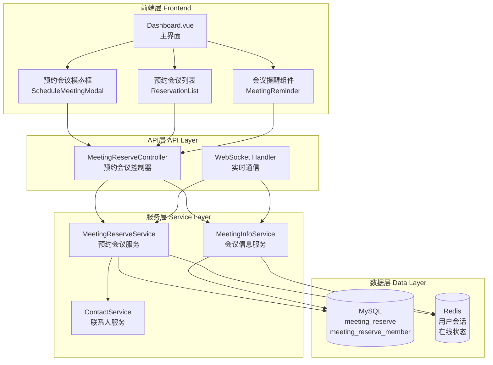
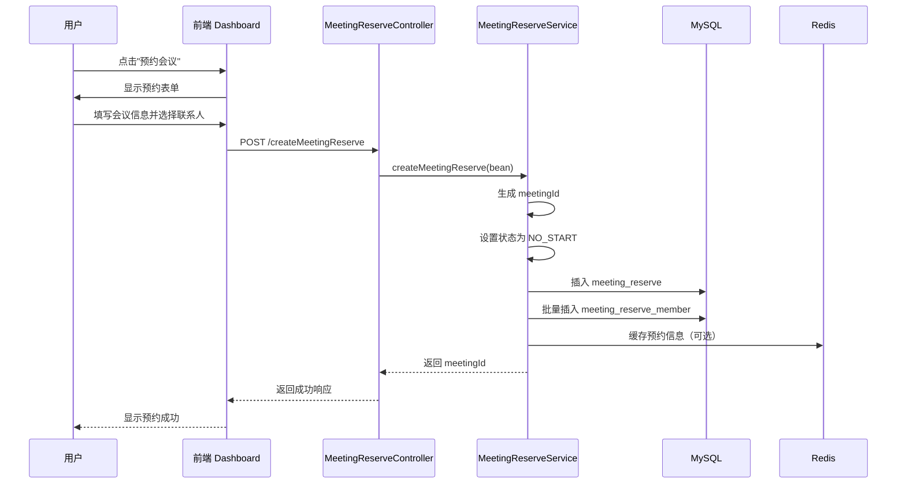
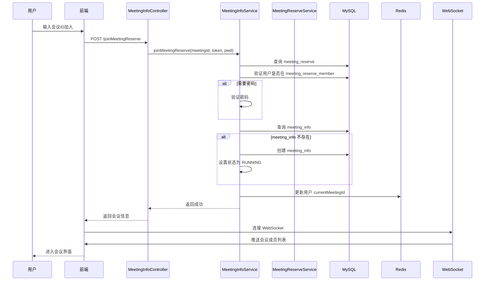
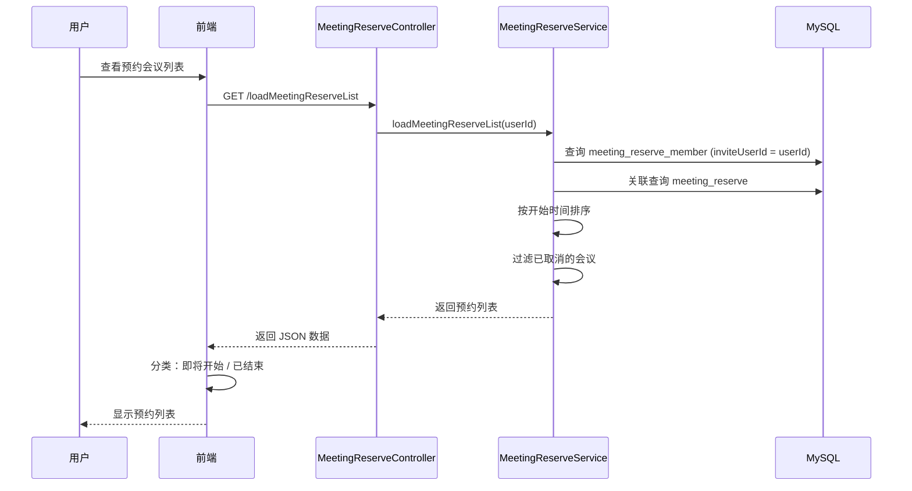

# 设计文档：会议预约功能 (meeting-reservation)

## 概述

会议预约功能是对现有即时会议系统的扩展，允许用户提前安排会议并邀请参与者。该功能基于现有的 MeetingReserve 和 MeetingReserveMember 实体，实现完整的预约会议生命周期管理，包括创建、查询、加入、修改和取消预约会议。

系统采用前后端分离架构，后端使用 Spring Boot + MyBatis + Redis，前端使用 Vue 3 + Element Plus，通过 WebSocket 实现实时通信。预约会议功能将无缝集成到现有的会议系统中，复用现有的 MeetingInfo 和 WebSocket 通信机制。

核心设计理念：
- 预约会议作为会议的"预定义模板"，在首次有人加入时自动创建实际的 MeetingInfo
- 只有被邀请的成员才能加入预约会议
- 支持密码保护和时间管理
- 提供会议提醒和状态跟踪

## 架构设计

### 系统架构图



### 核心流程序列图

#### 创建预约会议流程



#### 加入预约会议流程



#### 查询预约会议列表流程



## 组件和接口设计

### 后端组件

#### 1. MeetingReserveController（预约会议控制器）

**职责**：
- 处理预约会议相关的 HTTP 请求
- 参数验证和权限检查
- 调用服务层方法
- 返回统一格式的响应

**接口定义**：

```java
@RestController
@RequestMapping("/meetingReserve")
public class MeetingReserveController extends ABaseController {
    
    /**
     * 创建预约会议
     */
    @PostMapping("/createMeetingReserve")
    @GlobalInterceptor
    public ResponseVO createMeetingReserve(
        @NotEmpty String meetingName,
        @NotNull Date startTime,
        @NotNull Integer duration,
        @NotNull Integer joinType,
        String joinPassword,
        String inviteUserIds
    );
    
    /**
     * 查询用户的预约会议列表
     */
    @GetMapping("/loadMeetingReserveList")
    @GlobalInterceptor
    public ResponseVO<List<MeetingReserve>> loadMeetingReserveList();
    
    /**
     * 取消预约会议（创建者）
     */
    @PostMapping("/cancelMeetingReserve")
    @GlobalInterceptor
    public ResponseVO cancelMeetingReserve(@NotEmpty String meetingId);
    
    /**
     * 退出预约会议（被邀请者）
     */
    @PostMapping("/leaveMeetingReserve")
    @GlobalInterceptor
    public ResponseVO leaveMeetingReserve(@NotEmpty String meetingId);
    
    /**
     * 修改预约会议（仅创建者）
     */
    @PostMapping("/updateMeetingReserve")
    @GlobalInterceptor
    public ResponseVO updateMeetingReserve(
        @NotEmpty String meetingId,
        String meetingName,
        Date startTime,
        Integer duration,
        Integer joinType,
        String joinPassword,
        String inviteUserIds
    );
    
    /**
     * 查询预约会议详情
     */
    @GetMapping("/getMeetingReserveDetail")
    @GlobalInterceptor
    public ResponseVO<MeetingReserve> getMeetingReserveDetail(@NotEmpty String meetingId);
}
```


#### 2. MeetingReserveService（预约会议服务）

**职责**：
- 实现预约会议的业务逻辑
- 数据验证和权限控制
- 事务管理
- 与其他服务协作

**扩展接口定义**：

```java
public interface MeetingReserveService {
    
    // 现有方法（已实现）
    void createMeetingReserve(MeetingReserve bean);
    List<MeetingReserve> loadTodayMeeting(String userId);
    void deleteMeetingReserveByMeetingId(String meetingId, String userId);
    void deleteMeetingReserveByUserId(String meetingId, String userId);
    
    // 新增方法
    
    /**
     * 查询用户的所有预约会议（包括创建的和被邀请的）
     */
    List<MeetingReserve> loadMeetingReserveList(String userId);
    
    /**
     * 修改预约会议
     * 前置条件：用户必须是会议创建者
     */
    void updateMeetingReserve(MeetingReserve bean, String userId);
    
    /**
     * 查询预约会议详情（包含参与者列表）
     */
    MeetingReserveDetailVO getMeetingReserveDetail(String meetingId, String userId);
    
    /**
     * 检查用户是否有权限访问预约会议
     */
    boolean checkMeetingReserveAccess(String meetingId, String userId);
    
    /**
     * 获取即将开始的预约会议（未来1小时内）
     */
    List<MeetingReserve> getUpcomingMeetings(String userId);
}
```

#### 3. MeetingInfoService（会议信息服务扩展）

**职责**：
- 处理预约会议的加入逻辑（已实现 joinMeetingReserve）
- 从预约会议创建实际会议
- 管理会议状态

**现有方法**：

```java
public interface MeetingInfoService {
    /**
     * 加入预约会议（已实现）
     * 前置条件：
     * - 用户必须在 meeting_reserve_member 表中
     * - 如果需要密码，必须提供正确的密码
     * - 用户当前没有其他进行中的会议
     * 
     * 后置条件：
     * - 如果 meeting_info 不存在，则创建
     * - 更新用户的 currentMeetingId
     */
    void joinMeetingReserve(String meetingId, TokenUserInfoDto tokenUserInfo, String password);
}
```

### 前端组件

#### 1. ScheduleMeetingModal（预约会议模态框）

**职责**：
- 提供预约会议的表单界面
- 选择联系人
- 设置会议时间和密码
- 提交预约请求

**组件接口**：

```javascript
// ScheduleMeetingModal.vue
export default {
  props: {
    visible: Boolean
  },
  emits: ['update:visible', 'created'],
  data() {
    return {
      form: {
        meetingName: '',
        startTime: '',
        duration: 60, // 默认60分钟
        joinType: 0, // 0: 无密码, 1: 密码
        joinPassword: '',
        inviteUserIds: []
      },
      contactList: [],
      selectedContacts: []
    }
  },
  methods: {
    async loadContacts() {
      // 加载联系人列表
    },
    async handleSubmit() {
      // 提交预约会议
    },
    validateForm() {
      // 表单验证
    }
  }
}
```


#### 2. ReservationList（预约会议列表组件）

**职责**：
- 显示用户的预约会议列表
- 区分即将开始和已结束的会议
- 提供加入、取消、修改操作

**组件接口**：

```javascript
// ReservationList.vue
export default {
  data() {
    return {
      upcomingMeetings: [],
      endedMeetings: [],
      activeTab: 'upcoming'
    }
  },
  methods: {
    async loadMeetingReserveList() {
      // 加载预约会议列表
    },
    async joinMeeting(meetingId) {
      // 加入预约会议
    },
    async cancelMeeting(meetingId) {
      // 取消预约会议
    },
    async editMeeting(meeting) {
      // 编辑预约会议
    },
    formatMeetingTime(startTime, duration) {
      // 格式化会议时间
    },
    getMeetingStatus(meeting) {
      // 获取会议状态：未开始/进行中/已结束
    }
  }
}
```

#### 3. MeetingReminder（会议提醒组件）

**职责**：
- 显示即将开始的会议提醒
- 提供一键加入功能
- 定时检查即将开始的会议

**组件接口**：

```javascript
// MeetingReminder.vue
export default {
  data() {
    return {
      upcomingMeetings: [],
      reminderInterval: null
    }
  },
  mounted() {
    this.startReminderCheck();
  },
  beforeUnmount() {
    this.stopReminderCheck();
  },
  methods: {
    startReminderCheck() {
      // 每分钟检查一次即将开始的会议
      this.reminderInterval = setInterval(() => {
        this.checkUpcomingMeetings();
      }, 60000);
    },
    stopReminderCheck() {
      if (this.reminderInterval) {
        clearInterval(this.reminderInterval);
      }
    },
    async checkUpcomingMeetings() {
      // 检查未来1小时内的会议
    },
    async quickJoin(meetingId) {
      // 快速加入会议
    }
  }
}
```

## 数据模型

### MeetingReserve（预约会议实体）

```java
public class MeetingReserve implements Serializable {
    private String meetingId;           // 会议ID（主键）
    private String meetingName;         // 会议名称
    private Integer joinType;           // 加入方式：0-直接加入，1-密码加入
    private String joinPassword;        // 会议密码（最多5位）
    private Integer duration;           // 会议时长（分钟）
    private Date startTime;             // 开始时间
    private Date createTime;            // 创建时间
    private String createUserId;        // 创建者ID
    private Integer status;             // 状态：0-未开始，1-进行中，2-已结束，3-已取消
    
    // 扩展字段（非数据库字段）
    private String nickName;            // 创建者昵称
    private String inviteUserIds;       // 邀请的用户ID列表（逗号分隔）
}
```

**验证规则**：
- meetingName：非空，长度 1-50
- startTime：必须是未来时间
- duration：范围 15-480 分钟（15分钟到8小时）
- joinPassword：如果 joinType=1，则必填，长度5位
- inviteUserIds：可选，格式为逗号分隔的用户ID

**状态转换**：
```
NO_START(0) -> RUNNING(1) -> ENDED(2)
           \-> CANCELLED(3)
```

### MeetingReserveMember（预约会议成员实体）

```java
public class MeetingReserveMember implements Serializable {
    private String meetingId;           // 会议ID（联合主键）
    private String inviteUserId;        // 被邀请用户ID（联合主键）
}
```

**验证规则**：
- meetingId 和 inviteUserId 组合唯一
- inviteUserId 必须是有效的用户ID

### MeetingReserveDetailVO（预约会议详情VO）

```java
public class MeetingReserveDetailVO implements Serializable {
    private MeetingReserve meetingReserve;      // 预约会议信息
    private List<UserInfo> inviteMembers;       // 被邀请成员列表
    private Boolean isCreator;                  // 当前用户是否是创建者
    private String meetingStatus;               // 会议状态描述
}
```

## 核心算法与形式化规范

### 算法 1: 创建预约会议

```java
/**
 * 创建预约会议
 * 
 * 前置条件：
 * - bean.meetingName 非空且长度在 1-50 之间
 * - bean.startTime 是未来时间
 * - bean.duration 在 15-480 范围内
 * - 如果 bean.joinType == 1，则 bean.joinPassword 必须是5位字符
 * - bean.createUserId 是有效的用户ID
 * 
 * 后置条件：
 * - 生成唯一的 meetingId
 * - meeting_reserve 表插入一条记录，status = 0 (NO_START)
 * - meeting_reserve_member 表插入 N+1 条记录（N个被邀请者 + 1个创建者）
 * - 所有操作在同一事务中完成
 * 
 * 循环不变式：
 * - 在插入 meeting_reserve_member 时，所有已插入的记录都关联到同一个 meetingId
 */
@Transactional(rollbackFor = Exception.class)
public void createMeetingReserve(MeetingReserve bean) {
    // 步骤 1: 验证输入
    validateMeetingReserveInput(bean);
    
    // 步骤 2: 生成会议ID和设置初始状态
    bean.setMeetingId(StringTools.getMeetingNoOrMettingId());
    bean.setCreateTime(new Date());
    bean.setStatus(MeetingReserveStatusEnum.NO_START.getStatus());
    
    // 步骤 3: 插入预约会议记录
    this.meetingReserveMapper.insert(bean);
    
    // 步骤 4: 准备成员列表
    List<MeetingReserveMember> reserveMembers = new ArrayList<>();
    
    // 步骤 5: 添加被邀请者
    if (!StringUtils.isEmpty(bean.getInviteUserIds())) {
        String[] inviteUserIdArray = bean.getInviteUserIds().split(",");
        for (String userId : inviteUserIdArray) {
            // 循环不变式：所有成员都关联到 bean.getMeetingId()
            MeetingReserveMember member = new MeetingReserveMember();
            member.setMeetingId(bean.getMeetingId());
            member.setInviteUserId(userId.trim());
            reserveMembers.add(member);
        }
    }
    
    // 步骤 6: 添加创建者
    MeetingReserveMember hostMember = new MeetingReserveMember();
    hostMember.setMeetingId(bean.getMeetingId());
    hostMember.setInviteUserId(bean.getCreateUserId());
    reserveMembers.add(hostMember);
    
    // 步骤 7: 批量插入成员记录
    this.meetingReserveMemberMapper.insertBatch(reserveMembers);
}

/**
 * 验证预约会议输入
 * 
 * 前置条件：bean 非空
 * 后置条件：如果验证失败，抛出 BusinessException
 */
private void validateMeetingReserveInput(MeetingReserve bean) {
    if (StringUtils.isEmpty(bean.getMeetingName()) || 
        bean.getMeetingName().length() > 50) {
        throw new BusinessException("会议名称长度必须在1-50之间");
    }
    
    if (bean.getStartTime() == null || 
        bean.getStartTime().before(new Date())) {
        throw new BusinessException("开始时间必须是未来时间");
    }
    
    if (bean.getDuration() == null || 
        bean.getDuration() < 15 || 
        bean.getDuration() > 480) {
        throw new BusinessException("会议时长必须在15-480分钟之间");
    }
    
    if (MeetingJoinTypeEnum.PASSWORD.getStatus().equals(bean.getJoinType())) {
        if (StringUtils.isEmpty(bean.getJoinPassword()) || 
            bean.getJoinPassword().length() != 5) {
            throw new BusinessException("密码必须是5位字符");
        }
    }
}
```


### 算法 2: 查询用户的预约会议列表

```java
/**
 * 查询用户的预约会议列表
 * 
 * 前置条件：
 * - userId 非空且是有效的用户ID
 * 
 * 后置条件：
 * - 返回用户创建的和被邀请的所有预约会议
 * - 结果按 startTime 降序排序
 * - 不包含已取消的会议（status != 3）
 * 
 * 循环不变式：
 * - 在遍历 meeting_reserve_member 时，所有已处理的 meetingId 都是唯一的
 */
public List<MeetingReserve> loadMeetingReserveList(String userId) {
    // 步骤 1: 查询用户参与的所有预约会议ID
    MeetingReserveMemberQuery memberQuery = new MeetingReserveMemberQuery();
    memberQuery.setInviteUserId(userId);
    List<MeetingReserveMember> members = 
        this.meetingReserveMemberMapper.selectList(memberQuery);
    
    // 步骤 2: 如果没有参与任何预约会议，返回空列表
    if (members == null || members.isEmpty()) {
        return new ArrayList<>();
    }
    
    // 步骤 3: 提取所有 meetingId
    List<String> meetingIds = members.stream()
        .map(MeetingReserveMember::getMeetingId)
        .distinct()
        .collect(Collectors.toList());
    
    // 步骤 4: 批量查询预约会议详情
    MeetingReserveQuery reserveQuery = new MeetingReserveQuery();
    reserveQuery.setMeetingIds(meetingIds);
    reserveQuery.setStatusNotEqual(MeetingReserveStatusEnum.CANCELLED.getStatus());
    reserveQuery.setOrderBy("start_time DESC");
    
    List<MeetingReserve> result = this.meetingReserveMapper.selectList(reserveQuery);
    
    // 步骤 5: 填充创建者昵称（可选）
    for (MeetingReserve reserve : result) {
        UserInfo creator = userInfoMapper.selectByUserId(reserve.getCreateUserId());
        if (creator != null) {
            reserve.setNickName(creator.getNickName());
        }
    }
    
    return result;
}
```

### 算法 3: 修改预约会议

```java
/**
 * 修改预约会议
 * 
 * 前置条件：
 * - bean.meetingId 非空且存在
 * - userId 是会议的创建者
 * - 会议状态为 NO_START（未开始）
 * - 如果修改了 startTime，必须是未来时间
 * 
 * 后置条件：
 * - meeting_reserve 表更新成功
 * - 如果修改了 inviteUserIds，则更新 meeting_reserve_member 表
 * - 所有操作在同一事务中完成
 * 
 * 循环不变式：
 * - 在更新成员列表时，创建者始终在成员列表中
 */
@Transactional(rollbackFor = Exception.class)
public void updateMeetingReserve(MeetingReserve bean, String userId) {
    // 步骤 1: 查询现有预约会议
    MeetingReserve existing = this.meetingReserveMapper.selectByMeetingId(bean.getMeetingId());
    if (existing == null) {
        throw new BusinessException(ResponseCodeEnum.CODE_600);
    }
    
    // 步骤 2: 验证权限
    if (!existing.getCreateUserId().equals(userId)) {
        throw new BusinessException("只有创建者可以修改预约会议");
    }
    
    // 步骤 3: 验证状态
    if (!MeetingReserveStatusEnum.NO_START.getStatus().equals(existing.getStatus())) {
        throw new BusinessException("只能修改未开始的预约会议");
    }
    
    // 步骤 4: 验证修改内容
    if (bean.getStartTime() != null && bean.getStartTime().before(new Date())) {
        throw new BusinessException("开始时间必须是未来时间");
    }
    
    // 步骤 5: 更新预约会议信息
    this.meetingReserveMapper.updateByMeetingId(bean, bean.getMeetingId());
    
    // 步骤 6: 如果修改了邀请列表，更新成员表
    if (bean.getInviteUserIds() != null) {
        // 删除现有成员（除了创建者）
        MeetingReserveMemberQuery deleteQuery = new MeetingReserveMemberQuery();
        deleteQuery.setMeetingId(bean.getMeetingId());
        deleteQuery.setInviteUserIdNotEqual(userId);
        this.meetingReserveMemberMapper.deleteByParam(deleteQuery);
        
        // 插入新成员
        if (!StringUtils.isEmpty(bean.getInviteUserIds())) {
            List<MeetingReserveMember> newMembers = new ArrayList<>();
            String[] inviteUserIdArray = bean.getInviteUserIds().split(",");
            for (String inviteUserId : inviteUserIdArray) {
                if (!inviteUserId.trim().equals(userId)) {
                    MeetingReserveMember member = new MeetingReserveMember();
                    member.setMeetingId(bean.getMeetingId());
                    member.setInviteUserId(inviteUserId.trim());
                    newMembers.add(member);
                }
            }
            if (!newMembers.isEmpty()) {
                this.meetingReserveMemberMapper.insertBatch(newMembers);
            }
        }
    }
}
```

### 算法 4: 获取即将开始的预约会议

```java
/**
 * 获取即将开始的预约会议（未来1小时内）
 * 
 * 前置条件：
 * - userId 非空且是有效的用户ID
 * 
 * 后置条件：
 * - 返回未来1小时内开始的预约会议
 * - 只包含状态为 NO_START 的会议
 * - 结果按 startTime 升序排序
 */
public List<MeetingReserve> getUpcomingMeetings(String userId) {
    // 步骤 1: 计算时间范围
    Date now = new Date();
    Date oneHourLater = new Date(now.getTime() + 60 * 60 * 1000);
    
    // 步骤 2: 查询用户参与的预约会议
    MeetingReserveMemberQuery memberQuery = new MeetingReserveMemberQuery();
    memberQuery.setInviteUserId(userId);
    List<MeetingReserveMember> members = 
        this.meetingReserveMemberMapper.selectList(memberQuery);
    
    if (members == null || members.isEmpty()) {
        return new ArrayList<>();
    }
    
    // 步骤 3: 提取 meetingId 列表
    List<String> meetingIds = members.stream()
        .map(MeetingReserveMember::getMeetingId)
        .distinct()
        .collect(Collectors.toList());
    
    // 步骤 4: 查询即将开始的会议
    MeetingReserveQuery reserveQuery = new MeetingReserveQuery();
    reserveQuery.setMeetingIds(meetingIds);
    reserveQuery.setStatus(MeetingReserveStatusEnum.NO_START.getStatus());
    reserveQuery.setStartTimeStart(now);
    reserveQuery.setStartTimeEnd(oneHourLater);
    reserveQuery.setOrderBy("start_time ASC");
    
    return this.meetingReserveMapper.selectList(reserveQuery);
}
```

## 示例用法

### 后端示例

```java
// 示例 1: 创建预约会议
MeetingReserve reserve = new MeetingReserve();
reserve.setMeetingName("项目讨论会");
reserve.setStartTime(DateUtil.parse("2024-01-20 14:00", "yyyy-MM-dd HH:mm"));
reserve.setDuration(60);
reserve.setJoinType(MeetingJoinTypeEnum.PASSWORD.getStatus());
reserve.setJoinPassword("12345");
reserve.setCreateUserId("user123");
reserve.setInviteUserIds("user456,user789");

meetingReserveService.createMeetingReserve(reserve);

// 示例 2: 查询预约会议列表
List<MeetingReserve> myReservations = 
    meetingReserveService.loadMeetingReserveList("user123");

// 示例 3: 加入预约会议
TokenUserInfoDto token = getTokenUserInfo();
token.setCurrentNickName("张三");
meetingInfoService.joinMeetingReserve("meeting123", token, "12345");

// 示例 4: 修改预约会议
MeetingReserve update = new MeetingReserve();
update.setMeetingId("meeting123");
update.setMeetingName("项目讨论会（修改）");
update.setDuration(90);
meetingReserveService.updateMeetingReserve(update, "user123");

// 示例 5: 取消预约会议
meetingReserveService.deleteMeetingReserveByMeetingId("meeting123", "user123");
```


### 前端示例

```javascript
// 示例 1: 创建预约会议
async function createMeetingReserve() {
  const formData = {
    meetingName: '项目讨论会',
    startTime: '2024-01-20 14:00',
    duration: 60,
    joinType: 1,
    joinPassword: '12345',
    inviteUserIds: 'user456,user789'
  };
  
  const response = await axios.post('/meetingReserve/createMeetingReserve', formData);
  if (response.data.code === 200) {
    ElMessage.success('预约会议创建成功');
  }
}

// 示例 2: 加载预约会议列表
async function loadMeetingReserveList() {
  const response = await axios.get('/meetingReserve/loadMeetingReserveList');
  if (response.data.code === 200) {
    const meetings = response.data.data;
    
    // 分类：即将开始 vs 已结束
    const now = new Date();
    upcomingMeetings.value = meetings.filter(m => 
      new Date(m.startTime) > now && m.status === 0
    );
    endedMeetings.value = meetings.filter(m => 
      m.status === 2 || new Date(m.startTime) < now
    );
  }
}

// 示例 3: 加入预约会议
async function joinMeetingReserve(meetingId, password) {
  const response = await axios.post('/joinMeetingReserve', {
    meetingId,
    nickName: userInfo.value.nickName,
    password
  });
  
  if (response.data.code === 200) {
    // 跳转到会议页面
    router.push({
      name: 'Meeting',
      query: { meetingId }
    });
  }
}

// 示例 4: 会议提醒检查
async function checkUpcomingMeetings() {
  const response = await axios.get('/meetingReserve/getUpcomingMeetings');
  if (response.data.code === 200) {
    const upcoming = response.data.data;
    if (upcoming.length > 0) {
      // 显示提醒通知
      ElNotification({
        title: '会议提醒',
        message: `您有 ${upcoming.length} 个会议即将开始`,
        type: 'info',
        duration: 0
      });
    }
  }
}

// 示例 5: 取消预约会议
async function cancelMeetingReserve(meetingId) {
  await ElMessageBox.confirm('确定要取消这个预约会议吗？', '提示', {
    confirmButtonText: '确定',
    cancelButtonText: '取消',
    type: 'warning'
  });
  
  const response = await axios.post('/meetingReserve/cancelMeetingReserve', {
    meetingId
  });
  
  if (response.data.code === 200) {
    ElMessage.success('预约会议已取消');
    loadMeetingReserveList();
  }
}
```

## 正确性属性

*属性是系统在所有有效执行中应保持为真的特征或行为——本质上是关于系统应该做什么的形式化陈述。属性是人类可读规范和机器可验证正确性保证之间的桥梁。*

### 属性 1: 会议ID唯一性

*对于任意*两个预约会议，如果它们的 meetingId 相同，则它们必定是同一个会议。

**验证需求**: 需求 1.1, 需求 10.1

### 属性 2: 创建者必在成员列表（不变式）

*对于任意*预约会议，在任何操作后，创建者必定在成员列表中。

**验证需求**: 需求 1.3, 需求 4.8, 需求 10.2

### 属性 3: 初始状态正确性

*对于任意*新创建的预约会议，其状态必定为未开始。

**验证需求**: 需求 1.2, 需求 9.1

### 属性 4: 被邀请者添加完整性

*对于任意*预约会议和邀请列表，创建后所有被邀请者都应该在成员列表中。

**验证需求**: 需求 1.4

### 属性 5: 会议名称验证

*对于任意*会议名称，如果为空或长度超过50，系统应拒绝创建。

**验证需求**: 需求 1.5

### 属性 6: 开始时间验证

*对于任意*预约会议，如果开始时间是过去时间，系统应拒绝创建或修改。

**验证需求**: 需求 1.6, 需求 4.5, 需求 10.6

### 属性 7: 时长范围验证

*对于任意*预约会议，会议时长必须在15-480分钟范围内。

**验证需求**: 需求 1.7, 需求 10.5

### 属性 8: 密码长度验证

*对于任意*需要密码的预约会议，密码长度必须为5位。

**验证需求**: 需求 1.8, 需求 10.4

### 属性 9: 事务原子性

*对于任意*创建、修改或取消操作，所有数据库操作要么全部成功，要么全部回滚。

**验证需求**: 需求 1.9, 需求 4.9, 需求 5.5, 需求 10.7

### 属性 10: 查询结果完整性

*对于任意*用户，查询预约列表应返回该用户创建的和被邀请的所有未取消会议。

**验证需求**: 需求 2.1, 需求 2.2, 需求 2.4

### 属性 11: 查询结果排序

*对于任意*预约会议列表查询，结果应按开始时间降序排序。

**验证需求**: 需求 2.3

### 属性 12: 查询结果包含创建者信息

*对于任意*预约会议列表查询结果，每个会议都应包含创建者昵称信息。

**验证需求**: 需求 2.5

### 属性 13: 成员访问权限验证

*对于任意*用户和预约会议，用户能加入当且仅当用户在成员列表中。

**验证需求**: 需求 3.1, 需求 3.3, 需求 11.5

### 属性 14: 密码验证

*对于任意*需要密码的预约会议，只有提供正确密码才能加入。

**验证需求**: 需求 3.2, 需求 3.4

### 属性 15: 会议冲突检测

*对于任意*用户，如果当前在其他会议中，则不能加入新的预约会议。

**验证需求**: 需求 3.5

### 属性 16: MeetingInfo创建幂等性

*对于任意*预约会议，无论多少用户加入，只创建一个 MeetingInfo。

**验证需求**: 需求 3.6, 需求 3.7, 需求 12.1

### 属性 17: 加入后状态更新

*对于任意*用户成功加入预约会议，用户的当前会议ID应被更新，且会议状态应变为进行中。

**验证需求**: 需求 3.8, 需求 3.9, 需求 9.2

### 属性 18: 修改权限验证

*对于任意*预约会议修改请求，只有创建者且会议状态为未开始时才能修改。

**验证需求**: 需求 4.1, 需求 4.2, 需求 4.3, 需求 4.4, 需求 11.3

### 属性 19: 成员列表更新正确性

*对于任意*预约会议邀请列表修改，旧成员应被删除，新成员应被添加，但创建者始终保留。

**验证需求**: 需求 4.6, 需求 4.7, 需求 4.8

### 属性 20: 取消权限验证

*对于任意*预约会议取消请求，只有创建者才能取消。

**验证需求**: 需求 5.1, 需求 5.2, 需求 11.4

### 属性 21: 取消后状态和数据清理

*对于任意*预约会议取消操作，会议状态应变为已取消，且所有成员记录应被删除。

**验证需求**: 需求 5.3, 需求 5.4

### 属性 22: 退出权限验证

*对于任意*退出请求，只有在成员列表中的非创建者用户才能退出。

**验证需求**: 需求 6.1, 需求 6.2, 需求 6.3

### 属性 23: 退出后成员移除

*对于任意*用户退出预约会议，该用户应从成员列表中被删除。

**验证需求**: 需求 6.4

### 属性 24: 详情查询权限验证

*对于任意*预约会议详情查询，只有在成员列表中的用户才能查询。

**验证需求**: 需求 7.1, 需求 7.2, 需求 11.6

### 属性 25: 详情查询数据完整性

*对于任意*预约会议详情查询，结果应包含会议基本信息、所有参与者列表、创建者标识和状态描述。

**验证需求**: 需求 7.3, 需求 7.4, 需求 7.5, 需求 7.6

### 属性 26: 即将开始会议过滤

*对于任意*即将开始会议查询，应只返回未来1小时内开始且状态为未开始的会议，按开始时间升序排序。

**验证需求**: 需求 8.1, 需求 8.2, 需求 8.3

### 属性 27: 状态转换单调性

*对于任意*预约会议，状态转换遵循单调性：未开始→进行中→已结束，或未开始→已取消，且已结束和已取消状态不可变更。

**验证需求**: 需求 9.3, 需求 9.4, 需求 9.5, 需求 9.6

### 属性 28: 用户ID有效性

*对于任意*成员列表中的用户ID，必须是系统中有效的用户ID。

**验证需求**: 需求 10.3

### 属性 29: API认证

*对于任意*API请求，必须包含有效的用户身份认证。

**验证需求**: 需求 11.1

### 属性 30: 错误响应正确性

*对于任意*错误场景（会议不存在、密码错误、无权限访问、参数验证失败、系统错误），系统应返回相应的错误信息。

**验证需求**: 需求 13.1, 需求 13.2, 需求 13.3, 需求 13.4, 需求 13.5

## 错误处理

### 错误场景 1: 会议不存在

**条件**：用户尝试加入或操作不存在的预约会议
**响应**：返回 ResponseCodeEnum.CODE_600（会议不存在）
**恢复**：提示用户检查会议ID是否正确

### 错误场景 2: 无权限访问

**条件**：用户不在预约会议的成员列表中
**响应**：返回 ResponseCodeEnum.CODE_600 或自定义错误码
**恢复**：提示用户联系会议创建者获取邀请

### 错误场景 3: 密码错误

**条件**：加入需要密码的会议时，提供的密码不正确
**响应**：返回 ResponseCodeEnum.CODE_703（密码错误）
**恢复**：提示用户重新输入密码

### 错误场景 4: 时间冲突

**条件**：用户当前已在其他会议中
**响应**：抛出 BusinessException("你有未结束的会议")
**恢复**：提示用户先退出当前会议

### 错误场景 5: 修改权限不足

**条件**：非创建者尝试修改预约会议
**响应**：抛出 BusinessException("只有创建者可以修改预约会议")
**恢复**：提示用户只有创建者可以修改

### 错误场景 6: 会议已开始

**条件**：尝试修改已开始的预约会议
**响应**：抛出 BusinessException("只能修改未开始的预约会议")
**恢复**：提示用户会议已开始，无法修改

### 错误场景 7: 时间验证失败

**条件**：创建或修改时，开始时间是过去时间
**响应**：抛出 BusinessException("开始时间必须是未来时间")
**恢复**：提示用户选择未来的时间

### 错误场景 8: 参数验证失败

**条件**：会议名称、时长等参数不符合要求
**响应**：抛出 BusinessException 并说明具体错误
**恢复**：提示用户修正输入参数

## 测试策略

### 单元测试方法

**测试类**：MeetingReserveServiceTest

**测试用例**：

1. testCreateMeetingReserve_Success
   - 验证成功创建预约会议
   - 检查 meetingId 生成
   - 验证成员列表包含创建者

2. testCreateMeetingReserve_InvalidTime
   - 验证开始时间为过去时间时抛出异常

3. testCreateMeetingReserve_InvalidDuration
   - 验证时长超出范围时抛出异常

4. testLoadMeetingReserveList_Success
   - 验证查询返回正确的预约列表
   - 验证结果按时间排序

5. testUpdateMeetingReserve_Success
   - 验证创建者可以修改预约会议

6. testUpdateMeetingReserve_NotCreator
   - 验证非创建者无法修改

7. testJoinMeetingReserve_Success
   - 验证成员可以成功加入
   - 验证自动创建 MeetingInfo

8. testJoinMeetingReserve_NotInvited
   - 验证未被邀请的用户无法加入

9. testJoinMeetingReserve_WrongPassword
   - 验证密码错误时无法加入

10. testCancelMeetingReserve_Success
    - 验证创建者可以取消会议
    - 验证成员记录被删除


### 属性测试方法

**测试库**：JUnit 5 + QuickTheories（Java属性测试库）

**属性测试用例**：

```java
@Test
public void property_meetingIdUniqueness() {
    // 属性：生成的 meetingId 总是唯一的
    qt()
        .forAll(integers().between(1, 1000))
        .check(n -> {
            Set<String> ids = new HashSet<>();
            for (int i = 0; i < n; i++) {
                String id = StringTools.getMeetingNoOrMettingId();
                ids.add(id);
            }
            return ids.size() == n;
        });
}

@Test
public void property_creatorAlwaysInMemberList() {
    // 属性：创建者总是在成员列表中
    qt()
        .forAll(
            strings().allPossible().ofLengthBetween(1, 20),
            strings().allPossible().ofLengthBetween(1, 50)
        )
        .check((creatorId, inviteIds) -> {
            MeetingReserve reserve = createTestReserve(creatorId, inviteIds);
            meetingReserveService.createMeetingReserve(reserve);
            
            List<MeetingReserveMember> members = 
                getMembersByMeetingId(reserve.getMeetingId());
            
            return members.stream()
                .anyMatch(m -> m.getInviteUserId().equals(creatorId));
        });
}

@Test
public void property_statusTransitionMonotonicity() {
    // 属性：状态转换遵循单调性
    qt()
        .forAll(integers().between(0, 3))
        .check(initialStatus -> {
            MeetingReserve reserve = createTestReserve();
            reserve.setStatus(initialStatus);
            
            // 验证状态转换规则
            if (initialStatus == 2 || initialStatus == 3) {
                // 已结束或已取消的会议不能改变状态
                return !canChangeStatus(reserve);
            }
            return true;
        });
}
```

### 集成测试方法

**测试场景**：

1. 完整的预约会议流程
   - 创建预约会议
   - 查询预约列表
   - 加入预约会议
   - 验证 MeetingInfo 创建
   - 验证 WebSocket 连接

2. 多用户协作场景
   - 用户A创建预约会议并邀请用户B、C
   - 用户B、C查询到预约会议
   - 用户B先加入，创建 MeetingInfo
   - 用户C后加入，复用 MeetingInfo
   - 验证所有用户都在会议中

3. 权限控制场景
   - 用户A创建预约会议
   - 用户B（未被邀请）尝试加入，失败
   - 用户A修改邀请列表，添加用户B
   - 用户B再次尝试加入，成功

## 性能考虑

### 数据库索引

```sql
-- meeting_reserve 表索引
CREATE INDEX idx_create_user_id ON meeting_reserve(create_user_id);
CREATE INDEX idx_start_time ON meeting_reserve(start_time);
CREATE INDEX idx_status ON meeting_reserve(status);
CREATE INDEX idx_create_time ON meeting_reserve(create_time);

-- meeting_reserve_member 表索引
CREATE INDEX idx_invite_user_id ON meeting_reserve_member(invite_user_id);
CREATE INDEX idx_meeting_id ON meeting_reserve_member(meeting_id);

-- 联合索引
CREATE INDEX idx_status_start_time ON meeting_reserve(status, start_time);
```

### 查询优化

1. **批量查询优化**
   - 使用 IN 查询批量获取预约会议信息
   - 避免 N+1 查询问题

2. **分页查询**
   - 对于历史会议列表，使用分页查询
   - 默认每页15条记录

3. **缓存策略**
   - 使用 Redis 缓存即将开始的会议列表（TTL: 5分钟）
   - 缓存用户的预约会议数量（TTL: 10分钟）

### 性能指标

- 创建预约会议：< 200ms
- 查询预约列表：< 100ms
- 加入预约会议：< 300ms
- 修改预约会议：< 200ms

### 并发控制

1. **乐观锁**
   - 使用版本号控制预约会议的并发修改

2. **分布式锁**
   - 使用 Redis 分布式锁控制 MeetingInfo 的创建
   - 防止多个用户同时加入时重复创建

```java
// 使用 Redis 分布式锁
String lockKey = "meeting:reserve:join:" + meetingId;
boolean locked = redisComponent.tryLock(lockKey, 10);
try {
    if (locked) {
        // 创建 MeetingInfo 的逻辑
    }
} finally {
    if (locked) {
        redisComponent.unlock(lockKey);
    }
}
```

## 安全考虑

### 认证和授权

1. **接口认证**
   - 所有接口使用 @GlobalInterceptor 注解
   - 验证用户 token 有效性

2. **权限验证**
   - 创建预约会议：需要登录
   - 查询预约列表：只能查询自己参与的会议
   - 修改预约会议：只有创建者可以修改
   - 取消预约会议：只有创建者可以取消
   - 加入预约会议：必须在成员列表中

### 数据验证

1. **输入验证**
   - 会议名称：XSS 过滤
   - 密码：长度和格式验证
   - 时间：范围验证
   - 用户ID：格式验证

2. **SQL注入防护**
   - 使用 MyBatis 参数化查询
   - 避免拼接 SQL

### 敏感信息保护

1. **密码处理**
   - 会议密码不加密存储（业务需求）
   - 但在日志中不输出密码

2. **用户信息**
   - 只返回必要的用户信息
   - 不暴露敏感字段

## 依赖关系

### 后端依赖

```xml
<!-- Spring Boot -->
<dependency>
    <groupId>org.springframework.boot</groupId>
    <artifactId>spring-boot-starter-web</artifactId>
</dependency>

<!-- MyBatis -->
<dependency>
    <groupId>org.mybatis.spring.boot</groupId>
    <artifactId>mybatis-spring-boot-starter</artifactId>
</dependency>

<!-- Redis -->
<dependency>
    <groupId>org.springframework.boot</groupId>
    <artifactId>spring-boot-starter-data-redis</artifactId>
</dependency>

<!-- WebSocket -->
<dependency>
    <groupId>org.springframework.boot</groupId>
    <artifactId>spring-boot-starter-websocket</artifactId>
</dependency>

<!-- MySQL -->
<dependency>
    <groupId>mysql</groupId>
    <artifactId>mysql-connector-java</artifactId>
</dependency>
```

### 前端依赖

```json
{
  "dependencies": {
    "vue": "^3.3.0",
    "vue-router": "^4.2.0",
    "axios": "^1.4.0",
    "element-plus": "^2.3.0",
    "dayjs": "^1.11.0"
  }
}
```

### 内部服务依赖

- MeetingReserveService → MeetingReserveMemberMapper
- MeetingReserveService → UserInfoMapper
- MeetingInfoService → MeetingReserveMapper
- MeetingInfoService → MeetingReserveMemberMapper
- MeetingInfoService → RedisComponent
- MeetingReserveController → MeetingReserveService
- MeetingReserveController → ContactService

## 数据库表结构

### meeting_reserve 表

```sql
CREATE TABLE `meeting_reserve` (
  `meeting_id` varchar(20) NOT NULL COMMENT '会议ID',
  `meeting_name` varchar(50) NOT NULL COMMENT '会议名称',
  `join_type` tinyint NOT NULL DEFAULT '0' COMMENT '加入方式：0-直接加入，1-密码加入',
  `join_password` varchar(5) DEFAULT NULL COMMENT '会议密码',
  `duration` int NOT NULL COMMENT '会议时长（分钟）',
  `start_time` datetime NOT NULL COMMENT '开始时间',
  `create_time` datetime NOT NULL COMMENT '创建时间',
  `create_user_id` varchar(20) NOT NULL COMMENT '创建者ID',
  `status` tinyint NOT NULL DEFAULT '0' COMMENT '状态：0-未开始，1-进行中，2-已结束，3-已取消',
  PRIMARY KEY (`meeting_id`),
  KEY `idx_create_user_id` (`create_user_id`),
  KEY `idx_start_time` (`start_time`),
  KEY `idx_status` (`status`),
  KEY `idx_status_start_time` (`status`, `start_time`)
) ENGINE=InnoDB DEFAULT CHARSET=utf8mb4 COMMENT='预约会议表';
```

### meeting_reserve_member 表

```sql
CREATE TABLE `meeting_reserve_member` (
  `meeting_id` varchar(20) NOT NULL COMMENT '会议ID',
  `invite_user_id` varchar(20) NOT NULL COMMENT '被邀请用户ID',
  PRIMARY KEY (`meeting_id`, `invite_user_id`),
  KEY `idx_invite_user_id` (`invite_user_id`)
) ENGINE=InnoDB DEFAULT CHARSET=utf8mb4 COMMENT='预约会议成员表';
```

## 实现计划

### 阶段 1: 后端核心功能（优先级：高）

1. 扩展 MeetingReserveService
   - 实现 loadMeetingReserveList 方法
   - 实现 updateMeetingReserve 方法
   - 实现 getMeetingReserveDetail 方法
   - 实现 getUpcomingMeetings 方法

2. 创建 MeetingReserveController
   - 实现所有 REST API 接口
   - 添加参数验证
   - 添加权限检查

3. 扩展 Mapper 接口
   - 添加批量查询方法
   - 添加条件查询方法

### 阶段 2: 前端界面（优先级：高）

1. 完善预约会议模态框
   - 实现表单验证
   - 实现联系人选择
   - 实现时间选择器
   - 集成 API 调用

2. 实现预约会议列表
   - 显示即将开始的会议
   - 显示历史会议
   - 实现加入、取消、修改操作

3. 实现会议提醒组件
   - 定时检查即将开始的会议
   - 显示提醒通知
   - 提供快速加入功能

### 阶段 3: 优化和增强（优先级：中）

1. 性能优化
   - 添加数据库索引
   - 实现 Redis 缓存
   - 优化查询语句

2. 用户体验优化
   - 添加加载状态
   - 添加错误提示
   - 优化移动端适配

3. 测试完善
   - 编写单元测试
   - 编写集成测试
   - 编写属性测试

### 阶段 4: 高级功能（优先级：低）

1. 会议提醒推送
   - 邮件提醒
   - WebSocket 推送

2. 日历集成
   - 显示会议日历视图
   - 导出到 iCal 格式

3. 会议统计
   - 统计用户的会议数量
   - 统计会议时长

## 总结

本设计文档详细描述了会议预约功能的完整技术方案，包括：

- 系统架构和核心流程
- 组件和接口设计
- 数据模型和验证规则
- 核心算法和形式化规范
- 正确性属性和测试策略
- 性能和安全考虑
- 实现计划

该设计基于现有的 MeetingReserve 和 MeetingReserveMember 实体，充分复用现有的会议系统和 WebSocket 通信机制，实现了完整的预约会议生命周期管理。设计遵循 SOLID 原则，具有良好的可扩展性和可维护性。
