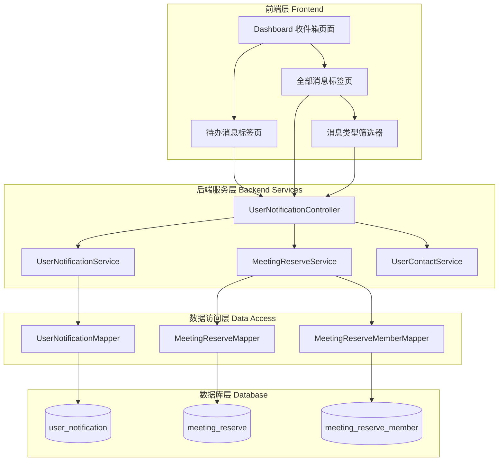
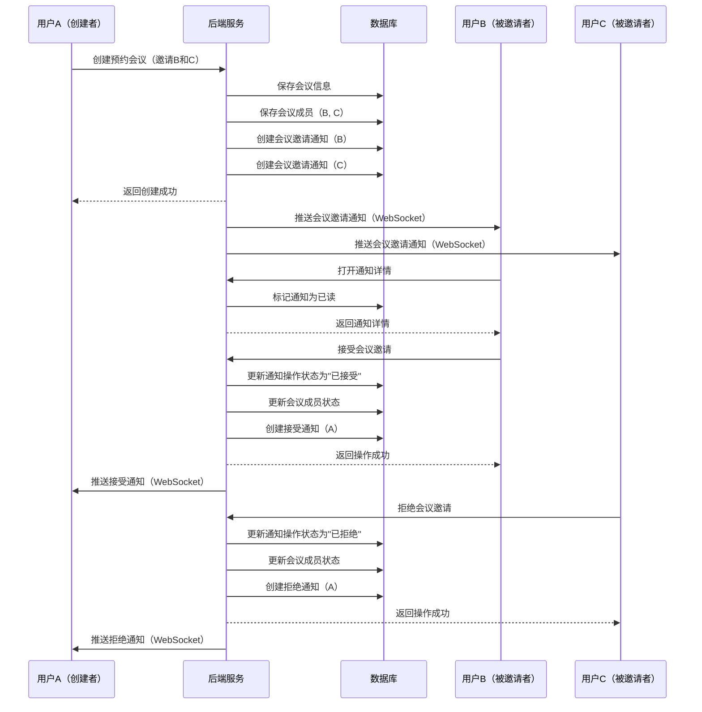

# 设计文档：统一收件箱系统（Unified Inbox System）

## 概述

统一收件箱系统旨在整合和扩展现有的通知系统，支持多种消息类型（联系人消息、会议消息、系统消息），提供分类管理和待办事项处理功能。系统将通知类型从原有的 3 种扩展到 11 种，并重构前端 UI 以支持消息分类筛选和待办事项管理。

核心改进包括：
- 扩展通知类型枚举，支持联系人、会议、系统三大类共 11 种消息类型
- 新增会议邀请功能，支持邀请、接受、拒绝、取消、变更等完整流程
- 重构收件箱 UI，提供"待办消息"和"全部消息"两个标签页
- 实现消息类型筛选功能，支持按类别查看消息
- 保持与现有通知系统的向后兼容性

## 系统架构



## 主要工作流程

### 会议邀请流程




## 组件和接口

### 后端组件

#### 1. NotificationTypeEnum（通知类型枚举）

**目的**：定义所有支持的通知类型

**接口**：
```java
public enum NotificationTypeEnum {
    // 联系人类消息（1-4）
    CONTACT_APPLY_PENDING(1, "好友申请待处理"),
    CONTACT_APPLY_ACCEPTED(2, "好友申请已同意"),
    CONTACT_APPLY_REJECTED(3, "好友申请已拒绝"),
    CONTACT_DELETED(4, "联系人删除通知"),
    
    // 会议类消息（5-9）
    MEETING_INVITE_PENDING(5, "会议邀请待处理"),
    MEETING_INVITE_ACCEPTED(6, "会议邀请已接受"),
    MEETING_INVITE_REJECTED(7, "会议邀请已拒绝"),
    MEETING_CANCELLED(8, "会议取消通知"),
    MEETING_TIME_CHANGED(9, "会议时间变更通知"),
    
    // 系统消息（10-11）
    SYSTEM_NOTIFICATION(10, "系统通知"),
    SYSTEM_MAINTENANCE(11, "维护通知");
    
    private Integer type;
    private String description;
    
    NotificationTypeEnum(Integer type, String description) {
        this.type = type;
        this.description = description;
    }
    
    public Integer getType() { return type; }
    public String getDescription() { return description; }
    
    public static NotificationTypeEnum getByType(Integer type) {
        for (NotificationTypeEnum e : values()) {
            if (e.getType().equals(type)) return e;
        }
        return null;
    }
    
    // 获取消息类别
    public NotificationCategory getCategory() {
        if (type >= 1 && type <= 4) return NotificationCategory.CONTACT;
        if (type >= 5 && type <= 9) return NotificationCategory.MEETING;
        if (type >= 10 && type <= 11) return NotificationCategory.SYSTEM;
        return NotificationCategory.SYSTEM;
    }
}

public enum NotificationCategory {
    CONTACT("联系人消息"),
    MEETING("会议消息"),
    SYSTEM("系统消息");
    
    private String description;
    
    NotificationCategory(String description) {
        this.description = description;
    }
    
    public String getDescription() { return description; }
}
```

**职责**：
- 定义所有通知类型的枚举值
- 提供类型到枚举的转换方法
- 提供通知类型到类别的映射

#### 2. UserNotificationService（扩展）

**目的**：处理通知的创建、查询、更新等业务逻辑

**新增接口**：
```java
public interface UserNotificationService {
    // 现有方法...
    
    /**
     * 创建会议邀请通知
     * @param meetingId 会议ID
     * @param inviteUserId 被邀请用户ID
     * @param creatorName 创建者昵称
     * @param meetingName 会议名称
     * @param startTime 会议开始时间
     */
    void createMeetingInviteNotification(String meetingId, String inviteUserId, 
                                        String creatorName, String meetingName, Date startTime);
    
    /**
     * 创建会议响应通知（接受/拒绝）
     * @param meetingId 会议ID
     * @param creatorUserId 会议创建者ID
     * @param responderName 响应者昵称
     * @param meetingName 会议名称
     * @param accepted 是否接受
     */
    void createMeetingResponseNotification(String meetingId, String creatorUserId,
                                          String responderName, String meetingName, boolean accepted);
    
    /**
     * 创建会议取消通知
     * @param meetingId 会议ID
     * @param inviteUserIds 被邀请用户ID列表
     * @param creatorName 创建者昵称
     * @param meetingName 会议名称
     */
    void createMeetingCancelNotification(String meetingId, List<String> inviteUserIds,
                                        String creatorName, String meetingName);
    
    /**
     * 创建会议时间变更通知
     * @param meetingId 会议ID
     * @param inviteUserIds 被邀请用户ID列表
     * @param creatorName 创建者昵称
     * @param meetingName 会议名称
     * @param newStartTime 新的开始时间
     */
    void createMeetingTimeChangeNotification(String meetingId, List<String> inviteUserIds,
                                            String creatorName, String meetingName, Date newStartTime);
    
    /**
     * 按类别查询通知列表
     * @param userId 用户ID
     * @param category 通知类别（CONTACT/MEETING/SYSTEM）
     * @param pageNo 页码
     * @param pageSize 每页数量
     * @return 分页结果
     */
    PaginationResultVO<UserNotification> getNotificationsByCategory(String userId, 
                                                                    NotificationCategory category,
                                                                    Integer pageNo, Integer pageSize);
    
    /**
     * 获取待办消息列表（需要操作的未处理消息）
     * @param userId 用户ID
     * @return 待办消息列表
     */
    List<UserNotification> getPendingActionNotifications(String userId);
    
    /**
     * 处理会议邀请（接受/拒绝）
     * @param notificationId 通知ID
     * @param userId 用户ID
     * @param accepted 是否接受
     */
    void handleMeetingInvite(Integer notificationId, String userId, boolean accepted);
}
```


#### 3. UserNotificationController（扩展）

**目的**：提供通知相关的 REST API 接口

**新增接口**：
```java
@RestController
@RequestMapping("/notification")
public class UserNotificationController extends ABaseController {
    
    /**
     * 按类别获取通知列表
     * GET /notification/loadNotificationsByCategory
     * @param category 类别：CONTACT/MEETING/SYSTEM
     * @param pageNo 页码
     * @param pageSize 每页数量
     */
    @RequestMapping("/loadNotificationsByCategory")
    @globalInterceptor(checkLogin = true)
    public ResponseVO loadNotificationsByCategory(String category, Integer pageNo, Integer pageSize);
    
    /**
     * 获取待办消息列表
     * GET /notification/loadPendingActions
     */
    @RequestMapping("/loadPendingActions")
    @globalInterceptor(checkLogin = true)
    public ResponseVO loadPendingActions();
    
    /**
     * 处理会议邀请
     * POST /notification/handleMeetingInvite
     * @param notificationId 通知ID
     * @param accepted 是否接受（true/false）
     */
    @RequestMapping("/handleMeetingInvite")
    @globalInterceptor(checkLogin = true)
    public ResponseVO handleMeetingInvite(Integer notificationId, Boolean accepted);
}
```

#### 4. MeetingReserveService（扩展）

**目的**：处理会议预约相关业务逻辑，集成通知功能

**扩展接口**：
```java
public interface MeetingReserveService {
    // 现有方法...
    
    /**
     * 创建预约会议（带通知）
     * 创建会议后自动发送邀请通知给所有被邀请用户
     */
    void createReservationWithNotification(MeetingReserve reserve, List<String> inviteUserIds);
    
    /**
     * 取消预约会议（带通知）
     * 取消会议后自动发送取消通知给所有被邀请用户
     */
    void cancelReservationWithNotification(String meetingId, String userId);
    
    /**
     * 更新会议时间（带通知）
     * 更新时间后自动发送变更通知给所有被邀请用户
     */
    void updateMeetingTimeWithNotification(String meetingId, Date newStartTime, String userId);
}
```

### 前端组件

#### 1. InboxView（收件箱主视图）

**目的**：收件箱页面的主容器组件

**接口**：
```typescript
interface InboxViewProps {
  // 无需 props，从路由获取状态
}

interface InboxViewState {
  activeTab: 'all' | 'pending';  // 当前激活的标签页
  selectedCategory: 'all' | 'contact' | 'meeting' | 'system';  // 选中的消息类别
  notificationList: Notification[];  // 通知列表
  pendingList: Notification[];  // 待办列表
  loading: boolean;  // 加载状态
  pageNo: number;  // 当前页码
  pageSize: number;  // 每页数量
  totalCount: number;  // 总数量
}

interface Notification {
  notificationId: number;
  userId: string;
  notificationType: number;
  relatedUserId: string;
  relatedUserName: string;
  title: string;
  content: string;
  status: number;  // 0=未读，1=已读
  actionRequired: number;  // 0=不需要，1=需要
  actionStatus: number;  // 0=待处理，1=已同意，2=已拒绝
  referenceId: string;
  createTime: string;
  updateTime: string;
}
```

**方法**：
```typescript
// 切换标签页
function switchTab(tab: 'all' | 'pending'): void

// 切换消息类别筛选
function switchCategory(category: string): void

// 加载通知列表
async function loadNotifications(): Promise<void>

// 加载待办列表
async function loadPendingActions(): Promise<void>

// 标记为已读
async function markAsRead(notificationId: number): Promise<void>

// 处理会议邀请
async function handleMeetingInvite(notificationId: number, accepted: boolean): Promise<void>

// 处理好友申请
async function handleContactApply(notificationId: number, accepted: boolean): Promise<void>
```

#### 2. NotificationItem（通知项组件）

**目的**：单个通知消息的展示组件

**接口**：
```typescript
interface NotificationItemProps {
  notification: Notification;
  onRead: (id: number) => void;
  onAction: (id: number, action: string) => void;
}
```

**职责**：
- 根据通知类型显示不同的图标和样式
- 显示通知标题、内容、时间
- 显示未读标志
- 提供操作按钮（接受/拒绝）

#### 3. CategoryFilter（类别筛选器组件）

**目的**：消息类别筛选下拉框

**接口**：
```typescript
interface CategoryFilterProps {
  selectedCategory: string;
  onCategoryChange: (category: string) => void;
}

interface CategoryOption {
  value: string;
  label: string;
  icon?: string;
}
```

**职责**：
- 显示类别选项（全部消息、联系人消息、会议消息、系统消息）
- 处理类别切换事件
- 显示当前选中的类别


## 数据模型

### 1. user_notification 表（扩展）

**现有字段**：
```sql
CREATE TABLE user_notification (
    notification_id INT AUTO_INCREMENT PRIMARY KEY COMMENT '通知ID',
    user_id VARCHAR(15) NOT NULL COMMENT '接收通知的用户ID',
    notification_type INT NOT NULL COMMENT '通知类型',
    related_user_id VARCHAR(15) COMMENT '相关用户ID',
    related_user_name VARCHAR(50) COMMENT '相关用户昵称',
    title VARCHAR(200) NOT NULL COMMENT '通知标题',
    content TEXT COMMENT '通知内容',
    status INT DEFAULT 0 COMMENT '通知状态：0=未读，1=已读',
    action_required INT DEFAULT 0 COMMENT '是否需要操作：0=不需要，1=需要',
    action_status INT DEFAULT 0 COMMENT '操作状态：0=待处理，1=已同意，2=已拒绝',
    reference_id VARCHAR(50) COMMENT '关联ID（如申请ID、会议ID）',
    create_time DATETIME DEFAULT CURRENT_TIMESTAMP COMMENT '创建时间',
    update_time DATETIME DEFAULT CURRENT_TIMESTAMP ON UPDATE CURRENT_TIMESTAMP COMMENT '更新时间',
    INDEX idx_user_id (user_id),
    INDEX idx_notification_type (notification_type),
    INDEX idx_status (status),
    INDEX idx_action_required (action_required),
    INDEX idx_reference_id (reference_id)
) ENGINE=InnoDB DEFAULT CHARSET=utf8mb4 COMMENT='用户通知表';
```

**notification_type 字段扩展说明**：
- 原有值：1=好友申请，2=联系人删除，3=系统通知
- 扩展后：
  - 1: 好友申请待处理（保持兼容）
  - 2: 好友申请已同意（新增）
  - 3: 好友申请已拒绝（新增）
  - 4: 联系人删除通知（原来的 2）
  - 5: 会议邀请待处理（新增）
  - 6: 会议邀请已接受（新增）
  - 7: 会议邀请已拒绝（新增）
  - 8: 会议取消通知（新增）
  - 9: 会议时间变更通知（新增）
  - 10: 系统通知（原来的 3）
  - 11: 维护通知（新增）

**数据迁移策略**：
```sql
-- 迁移现有数据
UPDATE user_notification SET notification_type = 10 WHERE notification_type = 3;  -- 系统通知
UPDATE user_notification SET notification_type = 4 WHERE notification_type = 2;   -- 联系人删除
-- notification_type = 1 保持不变（好友申请）
```

**字段使用说明**：
- `reference_id`: 
  - 联系人类消息：存储 apply_id（好友申请ID）
  - 会议类消息：存储 meeting_id（会议ID）
  - 系统消息：可为空或存储相关业务ID
- `action_required`:
  - 1: 需要操作（好友申请待处理、会议邀请待处理）
  - 0: 不需要操作（其他所有类型）
- `action_status`:
  - 0: 待处理（仅当 action_required=1 时有效）
  - 1: 已同意
  - 2: 已拒绝

### 2. meeting_reserve 表（现有）

```sql
CREATE TABLE meeting_reserve (
    meeting_id VARCHAR(15) PRIMARY KEY COMMENT '会议ID',
    meeting_name VARCHAR(100) NOT NULL COMMENT '会议名称',
    join_type INT NOT NULL COMMENT '加入方式：0=任何人可加入，1=需要密码',
    join_password VARCHAR(20) COMMENT '加入密码',
    duration INT NOT NULL COMMENT '会议时长（分钟）',
    start_time DATETIME NOT NULL COMMENT '开始时间',
    create_time DATETIME DEFAULT CURRENT_TIMESTAMP COMMENT '创建时间',
    create_user_id VARCHAR(15) NOT NULL COMMENT '创建者用户ID',
    status INT DEFAULT 0 COMMENT '状态：0=待开始，1=进行中，2=已结束，3=已取消',
    INDEX idx_create_user_id (create_user_id),
    INDEX idx_start_time (start_time),
    INDEX idx_status (status)
) ENGINE=InnoDB DEFAULT CHARSET=utf8mb4 COMMENT='会议预约表';
```

### 3. meeting_reserve_member 表（扩展）

**现有字段**：
```sql
CREATE TABLE meeting_reserve_member (
    meeting_id VARCHAR(15) NOT NULL COMMENT '会议ID',
    invite_user_id VARCHAR(15) NOT NULL COMMENT '被邀请用户ID',
    PRIMARY KEY (meeting_id, invite_user_id),
    INDEX idx_invite_user_id (invite_user_id)
) ENGINE=InnoDB DEFAULT CHARSET=utf8mb4 COMMENT='会议预约成员表';
```

**需要新增字段**：
```sql
ALTER TABLE meeting_reserve_member 
ADD COLUMN invite_status INT DEFAULT 0 COMMENT '邀请状态：0=待响应，1=已接受，2=已拒绝' AFTER invite_user_id,
ADD COLUMN response_time DATETIME COMMENT '响应时间' AFTER invite_status;
```

**扩展后的完整表结构**：
```sql
CREATE TABLE meeting_reserve_member (
    meeting_id VARCHAR(15) NOT NULL COMMENT '会议ID',
    invite_user_id VARCHAR(15) NOT NULL COMMENT '被邀请用户ID',
    invite_status INT DEFAULT 0 COMMENT '邀请状态：0=待响应，1=已接受，2=已拒绝',
    response_time DATETIME COMMENT '响应时间',
    PRIMARY KEY (meeting_id, invite_user_id),
    INDEX idx_invite_user_id (invite_user_id),
    INDEX idx_invite_status (invite_status)
) ENGINE=InnoDB DEFAULT CHARSET=utf8mb4 COMMENT='会议预约成员表';
```

### 4. 前端数据模型

#### NotificationTypeMap（通知类型映射）

```typescript
const NotificationTypeMap = {
  // 联系人类消息
  1: { category: 'contact', label: '好友申请', icon: 'user-add', needAction: true },
  2: { category: 'contact', label: '好友申请已同意', icon: 'user-check', needAction: false },
  3: { category: 'contact', label: '好友申请已拒绝', icon: 'user-x', needAction: false },
  4: { category: 'contact', label: '联系人删除', icon: 'user-minus', needAction: false },
  
  // 会议类消息
  5: { category: 'meeting', label: '会议邀请', icon: 'calendar-plus', needAction: true },
  6: { category: 'meeting', label: '会议邀请已接受', icon: 'calendar-check', needAction: false },
  7: { category: 'meeting', label: '会议邀请已拒绝', icon: 'calendar-x', needAction: false },
  8: { category: 'meeting', label: '会议已取消', icon: 'calendar-minus', needAction: false },
  9: { category: 'meeting', label: '会议时间变更', icon: 'calendar-edit', needAction: false },
  
  // 系统消息
  10: { category: 'system', label: '系统通知', icon: 'bell', needAction: false },
  11: { category: 'system', label: '维护通知', icon: 'tool', needAction: false }
}

const CategoryTitleMap = {
  contact: '联系人申请类消息',
  meeting: '会议消息',
  system: '系统消息'
}
```


## 关键函数与形式化规范

### 函数 1: createMeetingInviteNotification()

```java
void createMeetingInviteNotification(String meetingId, String inviteUserId, 
                                    String creatorName, String meetingName, Date startTime)
```

**前置条件**：
- `meetingId` 非空且存在于 meeting_reserve 表中
- `inviteUserId` 非空且存在于 user_info 表中
- `creatorName` 非空
- `meetingName` 非空
- `startTime` 非空且为未来时间

**后置条件**：
- 在 user_notification 表中创建一条新记录
- `notification_type` = 5（会议邀请待处理）
- `action_required` = 1（需要操作）
- `action_status` = 0（待处理）
- `status` = 0（未读）
- `reference_id` = meetingId
- 如果用户在线，通过 WebSocket 推送通知

**循环不变式**：N/A（无循环）

### 函数 2: handleMeetingInvite()

```java
void handleMeetingInvite(Integer notificationId, String userId, boolean accepted)
```

**前置条件**：
- `notificationId` 非空且存在于 user_notification 表中
- 通知的 `user_id` 等于参数 `userId`（权限验证）
- 通知的 `notification_type` = 5（会议邀请待处理）
- 通知的 `action_status` = 0（待处理状态）
- 关联的会议存在且未取消（status != 3）

**后置条件**：
- 更新通知的 `action_status`：accepted ? 1 : 2
- 更新通知的 `update_time` 为当前时间
- 更新 meeting_reserve_member 表中对应记录的 `invite_status`
- 更新 meeting_reserve_member 表中对应记录的 `response_time`
- 创建响应通知发送给会议创建者
- 响应通知的 `notification_type` = accepted ? 6 : 7
- 如果创建者在线，通过 WebSocket 推送响应通知

**循环不变式**：N/A（无循环）

### 函数 3: getNotificationsByCategory()

```java
PaginationResultVO<UserNotification> getNotificationsByCategory(
    String userId, NotificationCategory category, Integer pageNo, Integer pageSize)
```

**前置条件**：
- `userId` 非空
- `category` 为有效的枚举值（CONTACT/MEETING/SYSTEM）
- `pageNo` >= 1
- `pageSize` > 0 且 <= 100

**后置条件**：
- 返回分页结果对象
- 结果中的所有通知满足：`user_id` = userId
- 结果中的所有通知满足：`notification_type` 属于指定 category
- 结果按 `create_time` 降序排列
- 分页信息正确（pageNo, pageSize, totalCount）

**循环不变式**：N/A（数据库查询）

### 函数 4: getPendingActionNotifications()

```java
List<UserNotification> getPendingActionNotifications(String userId)
```

**前置条件**：
- `userId` 非空

**后置条件**：
- 返回通知列表
- 列表中的所有通知满足：`user_id` = userId
- 列表中的所有通知满足：`action_required` = 1
- 列表中的所有通知满足：`action_status` = 0
- 列表按 `create_time` 降序排列
- 列表分为两个子类别：
  - 待处理的好友申请（notification_type = 1）
  - 待处理的会议邀请（notification_type = 5）

**循环不变式**：N/A（数据库查询）

## 算法伪代码

### 主要处理算法

#### 算法 1: 创建会议邀请通知

```pascal
ALGORITHM createMeetingInviteNotification(meetingId, inviteUserId, creatorName, meetingName, startTime)
INPUT: meetingId (String), inviteUserId (String), creatorName (String), 
       meetingName (String), startTime (Date)
OUTPUT: void

BEGIN
  ASSERT meetingId ≠ null AND inviteUserId ≠ null
  ASSERT creatorName ≠ null AND meetingName ≠ null
  ASSERT startTime ≠ null AND startTime > currentTime()
  
  // 步骤 1: 构建通知对象
  notification ← NEW UserNotification()
  notification.userId ← inviteUserId
  notification.notificationType ← 5  // 会议邀请待处理
  notification.relatedUserId ← getMeetingCreatorId(meetingId)
  notification.relatedUserName ← creatorName
  notification.title ← "会议邀请"
  notification.content ← creatorName + " 邀请您参加会议「" + meetingName + "」"
  notification.status ← 0  // 未读
  notification.actionRequired ← 1  // 需要操作
  notification.actionStatus ← 0  // 待处理
  notification.referenceId ← meetingId
  notification.createTime ← currentTime()
  
  // 步骤 2: 保存到数据库
  notificationId ← notificationMapper.insert(notification)
  
  ASSERT notificationId > 0
  
  // 步骤 3: 推送实时通知
  IF isUserOnline(inviteUserId) THEN
    wsMessage ← buildWebSocketMessage(notification)
    sendWebSocketMessage(inviteUserId, wsMessage)
  END IF
  
  RETURN
END
```

**前置条件**：
- 所有输入参数非空
- meetingId 对应的会议存在
- inviteUserId 对应的用户存在
- startTime 为未来时间

**后置条件**：
- 数据库中创建了新的通知记录
- 如果用户在线，已发送 WebSocket 消息

**循环不变式**：N/A


#### 算法 2: 处理会议邀请

```pascal
ALGORITHM handleMeetingInvite(notificationId, userId, accepted)
INPUT: notificationId (Integer), userId (String), accepted (Boolean)
OUTPUT: void

BEGIN
  ASSERT notificationId > 0 AND userId ≠ null
  
  // 步骤 1: 查询并验证通知
  notification ← notificationMapper.selectById(notificationId)
  
  ASSERT notification ≠ null
  ASSERT notification.userId = userId  // 权限验证
  ASSERT notification.notificationType = 5  // 必须是会议邀请
  ASSERT notification.actionStatus = 0  // 必须是待处理状态
  
  meetingId ← notification.referenceId
  meeting ← meetingReserveMapper.selectById(meetingId)
  
  ASSERT meeting ≠ null
  ASSERT meeting.status ≠ 3  // 会议未取消
  
  // 步骤 2: 更新通知状态
  IF accepted = true THEN
    notification.actionStatus ← 1  // 已同意
  ELSE
    notification.actionStatus ← 2  // 已拒绝
  END IF
  
  notification.updateTime ← currentTime()
  notificationMapper.update(notification)
  
  // 步骤 3: 更新会议成员状态
  member ← meetingReserveMemberMapper.selectByMeetingAndUser(meetingId, userId)
  
  IF member ≠ null THEN
    IF accepted = true THEN
      member.inviteStatus ← 1  // 已接受
    ELSE
      member.inviteStatus ← 2  // 已拒绝
    END IF
    member.responseTime ← currentTime()
    meetingReserveMemberMapper.update(member)
  END IF
  
  // 步骤 4: 创建响应通知给会议创建者
  creatorId ← meeting.createUserId
  responderName ← getUserName(userId)
  
  responseNotification ← NEW UserNotification()
  responseNotification.userId ← creatorId
  
  IF accepted = true THEN
    responseNotification.notificationType ← 6  // 会议邀请已接受
    responseNotification.title ← "会议邀请已接受"
    responseNotification.content ← responderName + " 接受了您的会议邀请「" + meeting.meetingName + "」"
  ELSE
    responseNotification.notificationType ← 7  // 会议邀请已拒绝
    responseNotification.title ← "会议邀请已拒绝"
    responseNotification.content ← responderName + " 拒绝了您的会议邀请「" + meeting.meetingName + "」"
  END IF
  
  responseNotification.relatedUserId ← userId
  responseNotification.relatedUserName ← responderName
  responseNotification.status ← 0  // 未读
  responseNotification.actionRequired ← 0  // 不需要操作
  responseNotification.referenceId ← meetingId
  responseNotification.createTime ← currentTime()
  
  notificationMapper.insert(responseNotification)
  
  // 步骤 5: 推送实时通知给创建者
  IF isUserOnline(creatorId) THEN
    wsMessage ← buildWebSocketMessage(responseNotification)
    sendWebSocketMessage(creatorId, wsMessage)
  END IF
  
  RETURN
END
```

**前置条件**：
- notificationId 有效且属于 userId
- 通知类型为会议邀请待处理
- 通知状态为待处理
- 关联的会议存在且未取消

**后置条件**：
- 通知的 actionStatus 已更新
- 会议成员的 inviteStatus 已更新
- 创建了响应通知给会议创建者
- 如果创建者在线，已发送 WebSocket 消息

**循环不变式**：N/A

#### 算法 3: 按类别查询通知

```pascal
ALGORITHM getNotificationsByCategory(userId, category, pageNo, pageSize)
INPUT: userId (String), category (NotificationCategory), pageNo (Integer), pageSize (Integer)
OUTPUT: PaginationResultVO<UserNotification>

BEGIN
  ASSERT userId ≠ null
  ASSERT category ∈ {CONTACT, MEETING, SYSTEM}
  ASSERT pageNo ≥ 1 AND pageSize > 0 AND pageSize ≤ 100
  
  // 步骤 1: 确定通知类型范围
  IF category = CONTACT THEN
    typeRange ← [1, 2, 3, 4]
  ELSE IF category = MEETING THEN
    typeRange ← [5, 6, 7, 8, 9]
  ELSE IF category = SYSTEM THEN
    typeRange ← [10, 11]
  END IF
  
  // 步骤 2: 构建查询条件
  query ← NEW UserNotificationQuery()
  query.userId ← userId
  query.notificationTypeList ← typeRange
  query.orderBy ← "create_time DESC"
  query.pageNo ← pageNo
  query.pageSize ← pageSize
  
  // 步骤 3: 查询总数
  totalCount ← notificationMapper.selectCount(query)
  
  // 步骤 4: 查询分页数据
  IF totalCount > 0 THEN
    offset ← (pageNo - 1) × pageSize
    query.offset ← offset
    notificationList ← notificationMapper.selectList(query)
  ELSE
    notificationList ← EMPTY_LIST
  END IF
  
  // 步骤 5: 构建分页结果
  result ← NEW PaginationResultVO()
  result.list ← notificationList
  result.pageNo ← pageNo
  result.pageSize ← pageSize
  result.totalCount ← totalCount
  result.pageTotal ← CEILING(totalCount / pageSize)
  
  ASSERT result.list.size() ≤ pageSize
  ASSERT FOR ALL n IN result.list: n.userId = userId
  ASSERT FOR ALL n IN result.list: n.notificationType ∈ typeRange
  
  RETURN result
END
```

**前置条件**：
- userId 非空
- category 为有效枚举值
- pageNo >= 1, pageSize > 0

**后置条件**：
- 返回的分页结果包含正确的数据和分页信息
- 所有通知属于指定用户和类别
- 结果按创建时间降序排列

**循环不变式**：N/A（数据库查询）


#### 算法 4: 获取待办消息列表

```pascal
ALGORITHM getPendingActionNotifications(userId)
INPUT: userId (String)
OUTPUT: List<UserNotification>

BEGIN
  ASSERT userId ≠ null
  
  // 步骤 1: 构建查询条件
  query ← NEW UserNotificationQuery()
  query.userId ← userId
  query.actionRequired ← 1  // 需要操作
  query.actionStatus ← 0  // 待处理
  query.orderBy ← "create_time DESC"
  
  // 步骤 2: 查询待办通知
  pendingList ← notificationMapper.selectList(query)
  
  // 步骤 3: 验证结果
  ASSERT FOR ALL n IN pendingList: n.userId = userId
  ASSERT FOR ALL n IN pendingList: n.actionRequired = 1
  ASSERT FOR ALL n IN pendingList: n.actionStatus = 0
  ASSERT FOR ALL n IN pendingList: n.notificationType ∈ {1, 5}  // 好友申请或会议邀请
  
  // 步骤 4: 按类型分组（可选，用于前端展示）
  contactApplyList ← FILTER pendingList WHERE notificationType = 1
  meetingInviteList ← FILTER pendingList WHERE notificationType = 5
  
  RETURN pendingList
END
```

**前置条件**：
- userId 非空

**后置条件**：
- 返回的列表包含所有待处理的通知
- 所有通知的 actionRequired = 1 且 actionStatus = 0
- 结果按创建时间降序排列

**循环不变式**：
- 在过滤操作中，所有已处理的元素都满足过滤条件

## 示例用法

### 后端示例

#### 示例 1: 创建会议并发送邀请通知

```java
// 用户A创建预约会议，邀请用户B和C
MeetingReserve reserve = new MeetingReserve();
reserve.setMeetingId(generateMeetingId());
reserve.setMeetingName("项目讨论会");
reserve.setJoinType(0);
reserve.setDuration(60);
reserve.setStartTime(DateUtil.parse("2024-01-20 14:00", "yyyy-MM-dd HH:mm"));
reserve.setCreateUserId("userA");
reserve.setStatus(0);

List<String> inviteUserIds = Arrays.asList("userB", "userC");

// 创建会议并发送通知
meetingReserveService.createReservationWithNotification(reserve, inviteUserIds);

// 结果：
// 1. meeting_reserve 表插入一条记录
// 2. meeting_reserve_member 表插入两条记录（userB, userC）
// 3. user_notification 表插入两条通知（发给 userB 和 userC）
// 4. 如果 userB 和 userC 在线，通过 WebSocket 推送通知
```

#### 示例 2: 处理会议邀请

```java
// 用户B接受会议邀请
Integer notificationId = 123;
String userId = "userB";
boolean accepted = true;

userNotificationService.handleMeetingInvite(notificationId, userId, accepted);

// 结果：
// 1. user_notification 表中 notificationId=123 的记录 action_status 更新为 1
// 2. meeting_reserve_member 表中对应记录 invite_status 更新为 1
// 3. user_notification 表插入一条新通知（发给会议创建者 userA）
// 4. 如果 userA 在线，通过 WebSocket 推送通知
```

#### 示例 3: 按类别查询通知

```java
// 查询会议类消息
String userId = "userB";
NotificationCategory category = NotificationCategory.MEETING;
Integer pageNo = 1;
Integer pageSize = 20;

PaginationResultVO<UserNotification> result = 
    userNotificationService.getNotificationsByCategory(userId, category, pageNo, pageSize);

// 结果：
// result.list 包含所有会议类消息（类型 5-9）
// result.totalCount 为总数量
// result.pageTotal 为总页数
```

### 前端示例

#### 示例 1: 收件箱基本用法

```vue
<template>
  <div class="inbox-view">
    <!-- 标签页 -->
    <div class="inbox-tabs">
      <div 
        class="inbox-tab" 
        :class="{ active: activeTab === 'all' }"
        @click="switchTab('all')"
      >
        全部消息
      </div>
      <div 
        class="inbox-tab" 
        :class="{ active: activeTab === 'pending' }"
        @click="switchTab('pending')"
      >
        待办消息 <span v-if="pendingCount > 0">({{ pendingCount }})</span>
      </div>
    </div>
    
    <!-- 全部消息标签页 -->
    <div v-if="activeTab === 'all'" class="inbox-section">
      <!-- 类别筛选器 -->
      <div class="category-filter">
        <select v-model="selectedCategory" @change="loadNotifications">
          <option value="all">全部消息</option>
          <option value="contact">联系人消息</option>
          <option value="meeting">会议消息</option>
          <option value="system">系统消息</option>
        </select>
      </div>
      
      <!-- 消息列表 -->
      <div class="notification-list">
        <div 
          v-for="notification in notificationList" 
          :key="notification.notificationId"
          class="notification-item"
          :class="{ unread: notification.status === 0 }"
        >
          <!-- 类别封面标题 -->
          <div v-if="shouldShowCategoryTitle(notification)" class="category-title">
            {{ getCategoryTitle(notification.notificationType) }}
          </div>
          
          <!-- 通知内容 -->
          <div class="notification-content" @click="handleNotificationClick(notification)">
            <div class="notification-icon">
              
            </div>
            <div class="notification-body">
              <div class="notification-header">
                <span class="notification-title">{{ notification.title }}</span>
                <span class="notification-time">{{ formatTime(notification.createTime) }}</span>
              </div>
              <div class="notification-text">{{ notification.content }}</div>
            </div>
            <div v-if="notification.status === 0" class="unread-badge"></div>
          </div>
        </div>
      </div>
    </div>
    
    <!-- 待办消息标签页 -->
    <div v-if="activeTab === 'pending'" class="inbox-section">
      <!-- 待处理的好友申请 -->
      <div class="pending-section">
        <h3>待处理的好友申请</h3>
        <div 
          v-for="notification in contactApplyList" 
          :key="notification.notificationId"
          class="notification-item"
        >
          <div class="notification-content">
            <div class="notification-body">
              <span>{{ notification.content }}</span>
            </div>
            <div class="notification-actions">
              <button @click="handleContactApply(notification.notificationId, true)">同意</button>
              <button @click="handleContactApply(notification.notificationId, false)">拒绝</button>
            </div>
          </div>
        </div>
      </div>
      
      <!-- 待处理的会议邀请 -->
      <div class="pending-section">
        <h3>待处理的会议邀请</h3>
        <div 
          v-for="notification in meetingInviteList" 
          :key="notification.notificationId"
          class="notification-item"
        >
          <div class="notification-content">
            <div class="notification-body">
              <span>{{ notification.content }}</span>
            </div>
            <div class="notification-actions">
              <button @click="handleMeetingInvite(notification.notificationId, true)">接受</button>
              <button @click="handleMeetingInvite(notification.notificationId, false)">拒绝</button>
            </div>
          </div>
        </div>
      </div>
    </div>
  </div>
</template>

<script setup>
import { ref, computed, onMounted } from 'vue'
import { notificationService } from '@/api/services.js'

const activeTab = ref('all')
const selectedCategory = ref('all')
const notificationList = ref([])
const pendingList = ref([])

const contactApplyList = computed(() => 
  pendingList.value.filter(n => n.notificationType === 1)
)

const meetingInviteList = computed(() => 
  pendingList.value.filter(n => n.notificationType === 5)
)

const pendingCount = computed(() => pendingList.value.length)

// 切换标签页
function switchTab(tab) {
  activeTab.value = tab
  if (tab === 'all') {
    loadNotifications()
  } else {
    loadPendingActions()
  }
}

// 加载通知列表
async function loadNotifications() {
  const params = {
    category: selectedCategory.value,
    pageNo: 1,
    pageSize: 50
  }
  const result = await notificationService.loadNotificationsByCategory(params)
  notificationList.value = result.list
}

// 加载待办列表
async function loadPendingActions() {
  const result = await notificationService.loadPendingActions()
  pendingList.value = result
}

// 处理会议邀请
async function handleMeetingInvite(notificationId, accepted) {
  await notificationService.handleMeetingInvite({ notificationId, accepted })
  await loadPendingActions()
}

// 处理好友申请
async function handleContactApply(notificationId, accepted) {
  // 调用现有的好友申请处理接口
  await contactService.dealWithContactApply({ applyId: notificationId, status: accepted ? 1 : 2 })
  await loadPendingActions()
}

onMounted(() => {
  loadNotifications()
})
</script>
```


## 正确性属性

### 属性 1: 通知类型一致性

**描述**：所有通知的类型必须在定义的范围内，且类型与类别的映射关系正确。

**形式化表达**：
```
∀ notification ∈ user_notification:
  notification.notification_type ∈ [1, 11] ∧
  (notification.notification_type ∈ [1, 4] ⟹ getCategory(notification) = CONTACT) ∧
  (notification.notification_type ∈ [5, 9] ⟹ getCategory(notification) = MEETING) ∧
  (notification.notification_type ∈ [10, 11] ⟹ getCategory(notification) = SYSTEM)
```

### 属性 2: 待办消息必须可操作

**描述**：所有标记为需要操作的通知必须是待处理状态，且类型为好友申请或会议邀请。

**形式化表达**：
```
∀ notification ∈ user_notification:
  (notification.action_required = 1) ⟹
    (notification.action_status = 0 ∧
     notification.notification_type ∈ {1, 5})
```

### 属性 3: 会议邀请与会议成员状态同步

**描述**：会议邀请通知的操作状态必须与会议成员表中的邀请状态保持同步。

**形式化表达**：
```
∀ notification ∈ user_notification:
  (notification.notification_type = 5 ∧ notification.action_status ≠ 0) ⟹
    ∃ member ∈ meeting_reserve_member:
      (member.meeting_id = notification.reference_id ∧
       member.invite_user_id = notification.user_id ∧
       ((notification.action_status = 1 ⟹ member.invite_status = 1) ∧
        (notification.action_status = 2 ⟹ member.invite_status = 2)))
```

### 属性 4: 通知创建时间单调性

**描述**：对于同一用户的通知，通知ID越大，创建时间越晚（或相等）。

**形式化表达**：
```
∀ n1, n2 ∈ user_notification:
  (n1.user_id = n2.user_id ∧ n1.notification_id < n2.notification_id) ⟹
    n1.create_time ≤ n2.create_time
```

### 属性 5: 会议邀请响应的唯一性

**描述**：每个会议邀请通知只能被响应一次（从待处理变为已接受或已拒绝）。

**形式化表达**：
```
∀ notification ∈ user_notification:
  (notification.notification_type = 5 ∧ notification.action_status ≠ 0) ⟹
    ¬∃ operation: canChangeActionStatus(notification, operation)
```

### 属性 6: 分页查询完整性

**描述**：按类别分页查询的所有页面合并后，应包含该用户该类别的所有通知，且无重复。

**形式化表达**：
```
LET allNotifications = getAllNotificationsByCategory(userId, category)
LET paginatedResults = ⋃(i=1 to pageTotal) getNotificationsByCategory(userId, category, i, pageSize)

THEN:
  allNotifications = paginatedResults ∧
  ∀ page_i, page_j (i ≠ j): page_i ∩ page_j = ∅
```

### 属性 7: 未读通知计数准确性

**描述**：未读通知数量必须等于状态为未读的通知记录数。

**形式化表达**：
```
∀ userId:
  getUnreadCount(userId) = |{n ∈ user_notification | n.user_id = userId ∧ n.status = 0}|
```

### 属性 8: 会议取消后不可接受邀请

**描述**：如果会议已取消，则不能接受或拒绝该会议的邀请。

**形式化表达**：
```
∀ notification ∈ user_notification:
  (notification.notification_type = 5 ∧
   getMeetingStatus(notification.reference_id) = 3) ⟹
    ¬canHandleMeetingInvite(notification)
```

## 错误处理

### 错误场景 1: 会议已取消

**条件**：用户尝试接受或拒绝已取消会议的邀请

**响应**：
- 返回错误码：`MEETING_CANCELLED`
- 错误消息：`"该会议已被取消，无法响应邀请"`
- HTTP 状态码：400 Bad Request

**恢复**：
- 前端显示错误提示
- 刷新通知列表，显示会议取消通知
- 不更新通知状态

### 错误场景 2: 重复响应邀请

**条件**：用户尝试再次响应已处理的会议邀请

**响应**：
- 返回错误码：`ALREADY_RESPONDED`
- 错误消息：`"您已经响应过该邀请"`
- HTTP 状态码：400 Bad Request

**恢复**：
- 前端显示提示信息
- 刷新通知列表，显示最新状态
- 不执行任何更新操作

### 错误场景 3: 无权限操作通知

**条件**：用户尝试操作不属于自己的通知

**响应**：
- 返回错误码：`PERMISSION_DENIED`
- 错误消息：`"无权限操作该通知"`
- HTTP 状态码：403 Forbidden

**恢复**：
- 前端显示错误提示
- 不执行任何操作
- 记录安全日志

### 错误场景 4: 通知不存在

**条件**：用户尝试操作不存在的通知ID

**响应**：
- 返回错误码：`NOTIFICATION_NOT_FOUND`
- 错误消息：`"通知不存在"`
- HTTP 状态码：404 Not Found

**恢复**：
- 前端显示错误提示
- 刷新通知列表
- 移除前端缓存中的该通知

### 错误场景 5: 数据库连接失败

**条件**：数据库连接超时或不可用

**响应**：
- 返回错误码：`DATABASE_ERROR`
- 错误消息：`"服务暂时不可用，请稍后重试"`
- HTTP 状态码：503 Service Unavailable

**恢复**：
- 前端显示友好的错误提示
- 提供重试按钮
- 后端记录错误日志并触发告警

### 错误场景 6: WebSocket 推送失败

**条件**：用户在线但 WebSocket 连接异常

**响应**：
- 通知仍然保存到数据库
- 记录推送失败日志
- 不影响主流程

**恢复**：
- 用户下次刷新页面或轮询时可以看到通知
- 后端监控 WebSocket 连接质量
- 前端实现轮询作为降级方案


## 测试策略

### 单元测试方法

#### 后端单元测试

**测试目标**：验证各个服务方法的业务逻辑正确性

**关键测试用例**：

1. **NotificationTypeEnum 测试**
   - 测试所有枚举值的类型和描述
   - 测试 `getByType()` 方法的正确性
   - 测试 `getCategory()` 方法的映射关系
   - 测试无效类型的处理

2. **UserNotificationService 测试**
   - `createMeetingInviteNotification()`: 验证通知创建的完整性
   - `handleMeetingInvite()`: 验证接受/拒绝逻辑和状态更新
   - `getNotificationsByCategory()`: 验证分类查询和分页逻辑
   - `getPendingActionNotifications()`: 验证待办消息筛选
   - 测试边界条件（空列表、无效参数等）

3. **MeetingReserveService 测试**
   - `createReservationWithNotification()`: 验证会议创建和通知发送
   - `cancelReservationWithNotification()`: 验证取消逻辑和通知
   - `updateMeetingTimeWithNotification()`: 验证时间变更和通知

**Mock 策略**：
- Mock Mapper 层，使用 Mockito 模拟数据库操作
- Mock WebSocket 服务，验证推送调用
- Mock 用户信息服务，提供测试数据

#### 前端单元测试

**测试目标**：验证组件的渲染和交互逻辑

**关键测试用例**：

1. **InboxView 组件测试**
   - 测试标签页切换功能
   - 测试类别筛选功能
   - 测试通知列表渲染
   - 测试待办消息分组显示

2. **NotificationItem 组件测试**
   - 测试不同类型通知的渲染
   - 测试未读标志显示
   - 测试操作按钮的显示和点击

3. **CategoryFilter 组件测试**
   - 测试选项渲染
   - 测试选择变更事件

**测试工具**：
- Vue Test Utils
- Vitest
- Mock API 响应

### 属性测试方法

**测试库**：使用 QuickCheck（Java）或 fast-check（TypeScript）

**属性测试用例**：

#### 属性 1: 通知类型映射的双射性

```java
@Property
void notificationTypeCategoryMappingIsBijective(
    @ForAll @IntRange(min = 1, max = 11) int type) {
    
    NotificationTypeEnum enumValue = NotificationTypeEnum.getByType(type);
    assertNotNull(enumValue);
    
    NotificationCategory category = enumValue.getCategory();
    assertNotNull(category);
    
    // 验证类型范围与类别的对应关系
    if (type >= 1 && type <= 4) {
        assertEquals(NotificationCategory.CONTACT, category);
    } else if (type >= 5 && type <= 9) {
        assertEquals(NotificationCategory.MEETING, category);
    } else {
        assertEquals(NotificationCategory.SYSTEM, category);
    }
}
```

#### 属性 2: 分页查询的完整性和无重复性

```java
@Property
void paginationIsCompleteAndNonOverlapping(
    @ForAll("validUserId") String userId,
    @ForAll @IntRange(min = 1, max = 3) int categoryIndex,
    @ForAll @IntRange(min = 5, max = 20) int pageSize) {
    
    NotificationCategory category = NotificationCategory.values()[categoryIndex];
    
    // 获取总数
    int totalCount = getTotalCountByCategory(userId, category);
    int pageTotal = (int) Math.ceil((double) totalCount / pageSize);
    
    Set<Integer> allNotificationIds = new HashSet<>();
    
    // 遍历所有页
    for (int pageNo = 1; pageNo <= pageTotal; pageNo++) {
        PaginationResultVO<UserNotification> result = 
            service.getNotificationsByCategory(userId, category, pageNo, pageSize);
        
        // 验证每页的通知ID不重复
        for (UserNotification n : result.getList()) {
            boolean isNew = allNotificationIds.add(n.getNotificationId());
            assertTrue(isNew, "Duplicate notification ID found: " + n.getNotificationId());
        }
    }
    
    // 验证总数匹配
    assertEquals(totalCount, allNotificationIds.size());
}
```

#### 属性 3: 会议邀请响应的幂等性

```java
@Property
void meetingInviteResponseIsIdempotent(
    @ForAll("validNotificationId") Integer notificationId,
    @ForAll("validUserId") String userId,
    @ForAll boolean accepted) {
    
    // 第一次响应
    service.handleMeetingInvite(notificationId, userId, accepted);
    UserNotification after1 = service.getByNotificationId(notificationId);
    
    // 第二次响应（应该失败或无效）
    try {
        service.handleMeetingInvite(notificationId, userId, !accepted);
        fail("Should not allow second response");
    } catch (BusinessException e) {
        assertEquals("ALREADY_RESPONDED", e.getCode());
    }
    
    // 验证状态未改变
    UserNotification after2 = service.getByNotificationId(notificationId);
    assertEquals(after1.getActionStatus(), after2.getActionStatus());
}
```

#### 属性 4: 通知创建时间的单调性

```typescript
import fc from 'fast-check'

test('notification creation time is monotonic', () => {
  fc.assert(
    fc.property(
      fc.array(fc.record({
        notificationId: fc.integer({ min: 1, max: 1000 }),
        createTime: fc.date()
      }), { minLength: 2, maxLength: 50 }),
      (notifications) => {
        // 按 notificationId 排序
        const sorted = [...notifications].sort((a, b) => 
          a.notificationId - b.notificationId
        )
        
        // 验证时间单调性
        for (let i = 1; i < sorted.length; i++) {
          if (sorted[i].notificationId > sorted[i-1].notificationId) {
            expect(sorted[i].createTime.getTime())
              .toBeGreaterThanOrEqual(sorted[i-1].createTime.getTime())
          }
        }
      }
    )
  )
})
```

### 集成测试方法

**测试目标**：验证端到端的业务流程

**关键测试场景**：

1. **完整的会议邀请流程**
   - 用户A创建会议并邀请用户B和C
   - 验证B和C收到邀请通知
   - B接受邀请，验证A收到接受通知
   - C拒绝邀请，验证A收到拒绝通知
   - 验证数据库状态的一致性

2. **会议取消流程**
   - 用户A创建会议并邀请用户B
   - B接受邀请
   - A取消会议
   - 验证B收到取消通知
   - 验证B无法再次响应原邀请

3. **收件箱UI交互流程**
   - 用户登录并进入收件箱
   - 切换到待办消息标签页
   - 处理好友申请
   - 处理会议邀请
   - 切换到全部消息标签页
   - 使用类别筛选器
   - 验证消息列表更新

**测试环境**：
- 使用测试数据库（H2 或 MySQL 测试实例）
- 启动完整的 Spring Boot 应用
- 使用 TestRestTemplate 或 MockMvc 进行 API 测试
- 前端使用 Cypress 或 Playwright 进行 E2E 测试


## 性能考虑

### 1. 数据库查询优化

**索引策略**：
- `user_notification` 表已有索引：
  - `idx_user_id`: 用于按用户查询
  - `idx_notification_type`: 用于按类型查询
  - `idx_status`: 用于按状态查询
  - `idx_action_required`: 用于查询待办消息
  - `idx_reference_id`: 用于关联查询

**建议新增复合索引**：
```sql
-- 优化待办消息查询
CREATE INDEX idx_user_action ON user_notification(user_id, action_required, action_status);

-- 优化按类别分页查询
CREATE INDEX idx_user_type_time ON user_notification(user_id, notification_type, create_time DESC);
```

**查询优化**：
- 使用分页查询避免一次性加载大量数据
- 限制单次查询的最大记录数（如 100 条）
- 使用 `LIMIT` 和 `OFFSET` 进行分页

### 2. 缓存策略

**Redis 缓存方案**：

```java
// 缓存未读通知数量（5分钟过期）
String cacheKey = "notification:unread:" + userId;
Integer count = redisComponent.get(cacheKey);
if (count == null) {
    count = notificationMapper.selectUnreadCount(userId);
    redisComponent.set(cacheKey, count, 300);  // 5分钟
}

// 缓存待办消息列表（1分钟过期）
String pendingKey = "notification:pending:" + userId;
List<UserNotification> pendingList = redisComponent.get(pendingKey);
if (pendingList == null) {
    pendingList = notificationMapper.selectPendingActions(userId);
    redisComponent.set(pendingKey, pendingList, 60);  // 1分钟
}
```

**缓存失效策略**：
- 创建新通知时：清除对应用户的未读数量缓存和待办列表缓存
- 标记已读时：清除未读数量缓存
- 处理操作时：清除待办列表缓存

### 3. WebSocket 推送优化

**批量推送**：
- 会议邀请多人时，使用批量推送而非逐个推送
- 实现消息队列缓冲，避免瞬时大量推送

**推送降级**：
- WebSocket 推送失败时，不影响主流程
- 前端实现轮询作为降级方案（每 30 秒轮询一次）

### 4. 前端性能优化

**虚拟滚动**：
- 对于长列表（超过 50 条），使用虚拟滚动技术
- 只渲染可见区域的通知项

**懒加载**：
- 实现下拉加载更多功能
- 初始只加载前 20 条通知

**防抖和节流**：
- 类别筛选器变更时使用防抖（300ms）
- 滚动加载使用节流（500ms）

### 5. 性能指标

**目标性能指标**：
- 通知列表查询响应时间：< 200ms（P95）
- 创建通知响应时间：< 100ms（P95）
- 处理会议邀请响应时间：< 300ms（P95）
- WebSocket 推送延迟：< 500ms（P95）
- 前端页面加载时间：< 1s（P95）

**监控指标**：
- 数据库查询耗时
- API 响应时间
- WebSocket 连接数和推送成功率
- 缓存命中率
- 前端页面渲染时间

## 安全考虑

### 1. 权限验证

**通知访问控制**：
```java
// 验证用户只能访问自己的通知
public void markAsRead(Integer notificationId, String userId) {
    UserNotification notification = notificationMapper.selectById(notificationId);
    if (notification == null) {
        throw new BusinessException("通知不存在");
    }
    if (!notification.getUserId().equals(userId)) {
        throw new BusinessException("无权限操作该通知");
    }
    // 执行标记已读操作
}
```

**会议邀请权限验证**：
```java
// 验证用户只能响应发给自己的邀请
public void handleMeetingInvite(Integer notificationId, String userId, boolean accepted) {
    UserNotification notification = notificationMapper.selectById(notificationId);
    
    // 权限验证
    if (!notification.getUserId().equals(userId)) {
        throw new BusinessException("无权限操作该通知");
    }
    
    // 类型验证
    if (notification.getNotificationType() != 5) {
        throw new BusinessException("该通知不是会议邀请");
    }
    
    // 状态验证
    if (notification.getActionStatus() != 0) {
        throw new BusinessException("该邀请已被处理");
    }
    
    // 执行响应操作
}
```

### 2. 输入验证

**参数验证**：
```java
// 验证分页参数
if (pageNo < 1) {
    throw new BusinessException("页码必须大于0");
}
if (pageSize < 1 || pageSize > 100) {
    throw new BusinessException("每页数量必须在1-100之间");
}

// 验证类别参数
if (category != null && !Arrays.asList("CONTACT", "MEETING", "SYSTEM").contains(category)) {
    throw new BusinessException("无效的消息类别");
}
```

**SQL 注入防护**：
- 使用 MyBatis 的参数化查询（`#{}`）
- 避免使用字符串拼接构建 SQL
- 对用户输入进行转义

### 3. XSS 防护

**前端输出转义**：
```vue
<!-- 使用 Vue 的文本插值（自动转义） -->
<div>{{ notification.content }}</div>

<!-- 避免使用 v-html（除非内容已消毒） -->
<div v-html="sanitizedContent"></div>
```

**后端内容过滤**：
```java
// 创建通知时过滤 HTML 标签
public void createNotification(UserNotification notification) {
    notification.setTitle(StringEscapeUtils.escapeHtml4(notification.getTitle()));
    notification.setContent(StringEscapeUtils.escapeHtml4(notification.getContent()));
    notificationMapper.insert(notification);
}
```

### 4. CSRF 防护

**使用 Spring Security CSRF Token**：
```java
@Configuration
public class SecurityConfig extends WebSecurityConfigurerAdapter {
    @Override
    protected void configure(HttpSecurity http) throws Exception {
        http.csrf()
            .csrfTokenRepository(CookieCsrfTokenRepository.withHttpOnlyFalse());
    }
}
```

**前端携带 CSRF Token**：
```typescript
// 从 Cookie 中读取 CSRF Token
const csrfToken = document.cookie
  .split('; ')
  .find(row => row.startsWith('XSRF-TOKEN='))
  ?.split('=')[1]

// 在请求头中携带
axios.defaults.headers.common['X-XSRF-TOKEN'] = csrfToken
```

### 5. 敏感信息保护

**日志脱敏**：
```java
// 记录日志时隐藏敏感信息
logger.info("User {} handled meeting invite, notificationId: {}", 
    maskUserId(userId), notificationId);

private String maskUserId(String userId) {
    if (userId.length() <= 4) return "****";
    return userId.substring(0, 2) + "****" + userId.substring(userId.length() - 2);
}
```

**数据传输加密**：
- 使用 HTTPS 加密所有 API 通信
- WebSocket 使用 WSS（WebSocket Secure）

## 依赖项

### 后端依赖

**核心框架**：
- Spring Boot 2.x
- Spring MVC
- MyBatis

**数据库**：
- MySQL 5.7+
- Redis（用于缓存）

**WebSocket**：
- Spring WebSocket
- 或现有的 WebSocket 实现（基于 Netty 或 Tio）

**工具库**：
- Apache Commons Lang（字符串处理）
- Jackson（JSON 序列化）
- Lombok（简化代码）

**测试框架**：
- JUnit 5
- Mockito
- Spring Boot Test

### 前端依赖

**核心框架**：
- Vue 3
- Vue Router
- Pinia（状态管理）

**UI 组件库**：
- Element Plus

**HTTP 客户端**：
- Axios

**WebSocket 客户端**：
- 原生 WebSocket API
- 或现有的 WebSocket 封装

**工具库**：
- Day.js（时间处理）
- DOMPurify（XSS 防护）

**测试框架**：
- Vitest
- Vue Test Utils
- Cypress（E2E 测试）

### 数据库迁移工具

**推荐使用**：
- Flyway 或 Liquibase（用于版本化数据库迁移）

**迁移脚本示例**：
```sql
-- V1__unified_inbox_migration.sql

-- 迁移现有通知类型
UPDATE user_notification SET notification_type = 10 WHERE notification_type = 3;
UPDATE user_notification SET notification_type = 4 WHERE notification_type = 2;

-- 添加会议成员表字段
ALTER TABLE meeting_reserve_member 
ADD COLUMN invite_status INT DEFAULT 0 COMMENT '邀请状态：0=待响应，1=已接受，2=已拒绝',
ADD COLUMN response_time DATETIME COMMENT '响应时间';

-- 添加新索引
CREATE INDEX idx_user_action ON user_notification(user_id, action_required, action_status);
CREATE INDEX idx_user_type_time ON user_notification(user_id, notification_type, create_time DESC);
CREATE INDEX idx_invite_status ON meeting_reserve_member(invite_status);
```

## 向后兼容性

### 数据迁移策略

**现有数据兼容**：
- 通知类型 1（好友申请）保持不变
- 通知类型 2（联系人删除）迁移到类型 4
- 通知类型 3（系统通知）迁移到类型 10

**迁移脚本**：
```sql
-- 备份现有数据
CREATE TABLE user_notification_backup AS SELECT * FROM user_notification;

-- 执行迁移
UPDATE user_notification SET notification_type = 10 WHERE notification_type = 3;
UPDATE user_notification SET notification_type = 4 WHERE notification_type = 2;

-- 验证迁移结果
SELECT notification_type, COUNT(*) FROM user_notification GROUP BY notification_type;
```

### API 兼容性

**保持现有 API 不变**：
- `/notification/loadNotificationList` 继续支持
- `/notification/getUnreadCount` 继续支持
- `/notification/markAsRead` 继续支持
- `/notification/markAllAsRead` 继续支持

**新增 API**：
- `/notification/loadNotificationsByCategory` 新增
- `/notification/loadPendingActions` 新增
- `/notification/handleMeetingInvite` 新增

### 前端兼容性

**渐进式升级**：
- 现有收件箱功能继续工作
- 新增的类别筛选和待办消息为可选功能
- 如果后端未升级，前端降级到原有功能

**特性检测**：
```typescript
// 检测后端是否支持新功能
async function checkFeatureSupport() {
  try {
    await notificationService.loadNotificationsByCategory({ category: 'all' })
    return true
  } catch (error) {
    console.warn('Backend does not support category filter, using legacy mode')
    return false
  }
}
```

## 实施计划

### 阶段 1: 后端基础设施（第 1-2 周）

1. 创建 `NotificationTypeEnum` 和 `NotificationCategory` 枚举
2. 执行数据库迁移脚本
3. 扩展 `UserNotificationService` 接口和实现
4. 扩展 `UserNotificationController` API
5. 编写单元测试

### 阶段 2: 会议邀请功能（第 3-4 周）

1. 扩展 `MeetingReserveService` 添加通知功能
2. 实现会议邀请创建和响应逻辑
3. 实现会议取消和时间变更通知
4. 集成 WebSocket 推送
5. 编写集成测试

### 阶段 3: 前端 UI 重构（第 5-6 周）

1. 重构收件箱页面，添加标签页
2. 实现消息类型筛选器
3. 实现待办消息分组显示
4. 实现会议邀请操作按钮
5. 优化样式和交互体验

### 阶段 4: 测试和优化（第 7 周）

1. 执行完整的集成测试
2. 执行性能测试和优化
3. 执行安全测试
4. 修复发现的问题
5. 编写用户文档

### 阶段 5: 上线和监控（第 8 周）

1. 灰度发布（10% 用户）
2. 监控性能指标和错误率
3. 收集用户反馈
4. 全量发布
5. 持续监控和优化
